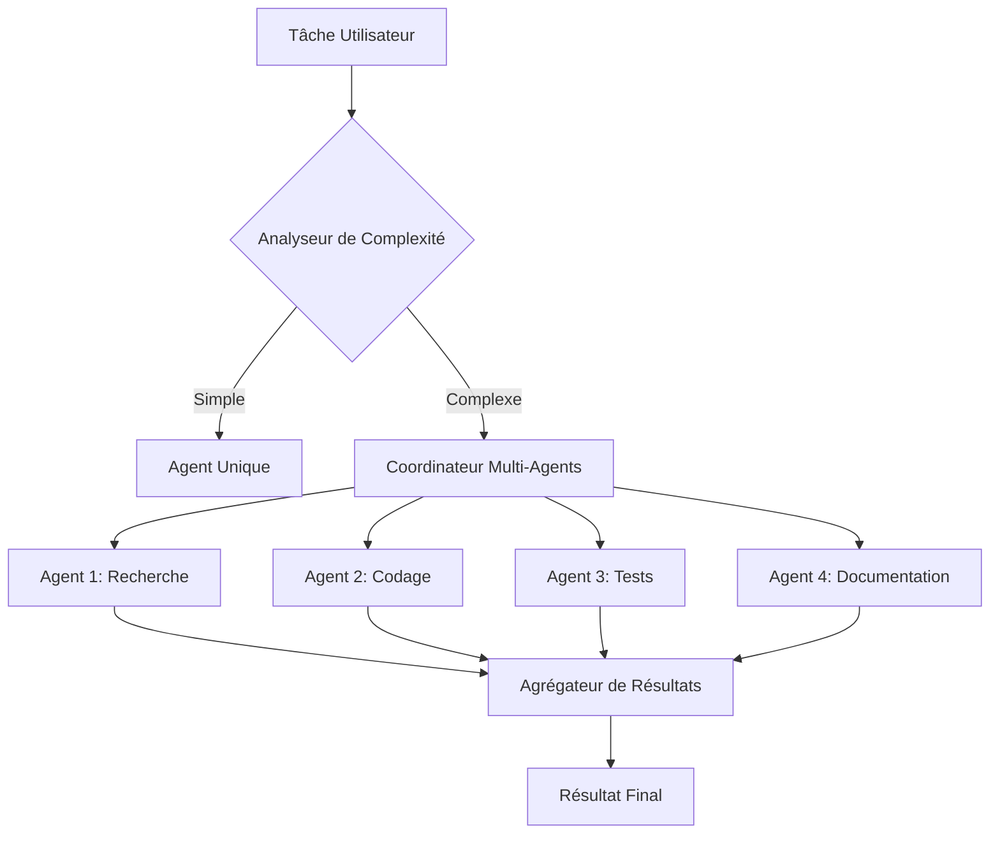

# SuperAgent - SDK d'Orchestration Multi-Agents Laravel de Niveau Entreprise 🚀

[](https://www.php.net/)
[](https://laravel.com)
[](LICENSE)
[](https://github.com/xiyanyang/superagent)

> **🌍 Langue**: [English](README.md) | [中文](README_CN.md) | [Français](README_FR.md)  
> **📖 Documentation**: [Installation Guide](INSTALL.md) | [安装手册](INSTALL_CN.md) | [Guide d'Installation](INSTALL_FR.md) | [Utilisation Avancée](docs/ADVANCED_USAGE_FR.md) | [Docs API](docs/)

SuperAgent est un SDK Laravel AI Agent de niveau entreprise puissant qui offre des capacités au niveau de Claude avec orchestration multi-agents, surveillance en temps réel et mise à l'échelle distribuée. Construisez et déployez des équipes d'agents IA qui travaillent en parallèle avec détection automatique de tâches et gestion intelligente des ressources.

## ✨ Fonctionnalités Principales

### 🆕 v0.7.9 — Injection de Dépendances & Renforcement Architectural (63 nouveaux tests unitaires)
- **Singleton → Injection par Constructeur** — 19 classes singleton (`AgentManager`, `TaskManager`, `MCPManager`, `ParallelAgentCoordinator`, `EventDispatcher`, `CostTracker`, etc.) ont maintenant des constructeurs publics avec `getInstance()` marqué `@deprecated`. 25 sites d'appel mis à jour pour accepter les dépendances injectées avec fallback rétrocompatible. Permet l'isolation correcte des tests et l'exécution Swarm sûre pour les processus
- **ToolStateManager** (`src/Tools/ToolStateManager.php`) — Conteneur d'état injectable centralisé remplaçant les propriétés `private static` dispersées dans 14 classes d'outils intégrés (`EnterPlanModeTool`, `ToolSearchTool`, `MonitorTool`, `REPLTool`, `SkillTool`, `WorkflowTool`, `BriefTool`, `ConfigTool`, `SnipTool`, `TodoWriteTool`, `AskUserQuestionTool`, `TerminalCaptureTool`, `VerifyPlanExecutionTool`). État basé sur des buckets avec IDs auto-incrémentés, helpers de collection et reset par outil. Injectez une instance partagée en mode Swarm pour la cohérence inter-processus
- **Décomposition de SessionManager** — Extraction de `SessionStorage` (I/O fichier atomique, scan de répertoires, résolution de chemins) et `SessionPruner` (nettoyage par âge + par comptage) du `SessionManager` de 631 lignes. Le gestionnaire délègue maintenant aux deux, réduit à la pure orchestration
- **Limite de Concurrence des Processus** — `ParallelToolExecutor::executeProcessParallel()` respecte maintenant `$maxParallel` (défaut 5), traitant les blocs d'outils par lots au lieu de lancer un nombre illimité de processus OS concurrents
- **Tests Unitaires pour les Fonctionnalités v0.7.6** — 63 nouveaux tests unitaires dans 4 classes de test dédiées : `ForkTest` (20 tests : cycle de vie des branches, gestion de session, stratégies de scoring, classement des résultats), `DebateTest` (12 tests : API fluide de config, données de rounds, agrégation de résultats), `CostPredictionTest` (18 tests : détection type/complexité, estimation de tokens, vérification de budget, comparaison de modèles), `ReplayTest` (13 tests : types d'événements, capture par enregistreur, comptage de pas, intervalles de snapshots)

### 🆕 v0.7.8 — Mode Agent Harness + Sous-systèmes Entreprise (20 sous-systèmes, 628 tests)
- **Gestionnaire de Tâches Persistant** (`src/Tasks/PersistentTaskManager.php`) — Persistance sur fichier avec index JSON + logs de sortie par tâche. `appendOutput()` / `readOutput()` pour le streaming de logs, `watchProcess()` + `pollProcesses()` pour la surveillance non-bloquante, marquage automatique des tâches obsolètes comme échouées au redémarrage, nettoyage par âge. Config : `persistence.tasks`
- **Gestionnaire de Sessions** (`src/Session/SessionManager.php`) — Sauvegarde/chargement/liste/suppression de snapshots de conversation dans `~/.superagent/sessions/`. `loadLatest()` avec filtrage CWD pour la reprise par projet, extraction automatique de résumé, assainissement des ID de session, nettoyage par comptage + âge. Config : `persistence.sessions`
- **Architecture d'Événements Stream** (`src/Harness/`) — 9 types d'événements unifiés (`TextDelta`, `ThinkingDelta`, `TurnComplete`, `ToolStarted`, `ToolCompleted`, `Compaction`, `Status`, `Error`, `AgentComplete`). `StreamEventEmitter` avec dispatch multi-écouteurs et pont `toStreamingHandler()` pour intégration QueryEngine sans modification
- **Boucle REPL Harness** (`src/Harness/HarnessLoop.php`) — Boucle agent interactive avec `CommandRouter` (10 commandes intégrées : `/help`, `/status`, `/tasks`, `/compact`, `/continue`, `/session`, `/clear`, `/model`, `/cost`, `/quit`). Verrouillage d'occupation, `continue_pending()` pour la reprise de boucles d'outils interrompues, sauvegarde automatique de session, enregistrement de commandes personnalisées
- **Auto-Compacteur** (`src/Harness/AutoCompactor.php`) — Compaction à deux niveaux : micro (tronquer les anciens résultats d'outils, sans LLM) → complet (résumé LLM via ContextManager). Disjoncteur d'échec, émission de `CompactionEvent`. `maybeCompact()` à chaque début de tour
- **Framework de Scénarios E2E** (`src/Harness/Scenario.php`, `ScenarioRunner.php`) — Définitions de scénarios structurées avec builder fluide, gestion d'espace de travail temporaire, suivi transparent des appels d'outils, validation 3D (outils requis + texte attendu + closure personnalisée), filtrage par tags, résumé réussite/échec/erreur
- **QueryEngine `continue_pending()`** — `hasPendingContinuation()` + `continuePending()` reprennent les boucles d'outils interrompues sans nouveau message utilisateur. Boucle interne extraite en méthode partagée `runLoop()`
- **Gestionnaire de Worktrees** (`src/Swarm/WorktreeManager.php`) — Gestion autonome du cycle de vie git worktree : création avec liens symboliques pour les grands répertoires (node_modules, vendor, .venv), persistance des métadonnées, reprise, nettoyage. Extrait de ProcessBackend
- **Backend Tmux** (`src/Swarm/Backends/TmuxBackend.php`) — Débogage visuel multi-agents : chaque agent s'exécute dans un panneau tmux. Auto-détection (`$TMUX` + `which tmux`), repli gracieux. `BackendType::TMUX`
- **Paramètres Prioritaires sur Config** — Tous les nouveaux sous-systèmes acceptent `array $overrides` dans `fromConfig()` avec priorité : `$overrides` > fichier de config > défauts. Permet d'activer des fonctionnalités désactivées en config directement à l'appel
- **Middleware de Retry API** (`src/Providers/RetryMiddleware.php`) — Backoff exponentiel avec jitter, support `Retry-After`, classification d'erreurs (auth/rate_limit/transient/unrecoverable), max retries configurable, journal de retry pour l'observabilité. Factory statique `wrap()`
- **Backend iTerm2** (`src/Swarm/Backends/ITermBackend.php`) — Débogage d'agents par panneaux via AppleScript, auto-détection (`$ITERM_SESSION_ID`), arrêt gracieux + arrêt forcé. `BackendType::ITERM2`
- **Système de Plugins** (`src/Plugins/`) — `PluginManifest` (parsé depuis `plugin.json`), `LoadedPlugin` (skills/hooks/MCP résolus), `PluginLoader` (découverte depuis `~/.superagent/plugins/` et `.superagent/plugins/`, activation/désactivation, installation/désinstallation, collecte à travers tous les plugins activés)
- **État d'Application Observable** (`src/State/`) — `AppState` objet valeur immuable avec `with()` pour mises à jour partielles. `AppStateStore` magasin observable avec `subscribe()` (retourne un callable de désabonnement), notification auto des écouteurs
- **Rechargement à Chaud des Hooks** (`src/Hooks/HookReloader.php`) — Surveille le mtime du fichier de config, recharge `HookRegistry` en cas de changement. Formats JSON et PHP. `forceReload()`, `hasChanged()`, factory `fromDefaults()`
- **Hooks Prompt & Agent** (`src/Hooks/PromptHook.php`, `AgentHook.php`) — Validation basée sur LLM : envoie un prompt avec injection `$ARGUMENTS`, attend `{"ok": true/false, "reason": "..."}`. `AgentHook` avec contexte étendu et timeout 60s. Les deux supportent `blockOnFailure` et patterns de matcher
- **Passerelle Multi-Canal** (`src/Channels/`) — `ChannelInterface`, `BaseChannel` avec ACL, `MessageBus` (inbound/outbound basé sur SplQueue), `ChannelManager` pour enregistrement/dispatch, `WebhookChannel` pour webhooks HTTP, objets valeur `InboundMessage`/`OutboundMessage`
- **Protocole Backend** (`src/Harness/BackendProtocol.php`, `FrontendRequest.php`) — Protocole JSON-lines (préfixe `SAJSON:`) pour la communication frontend ↔ backend. 8 émetteurs d'événements, `readRequest()`, `createStreamBridge()`. `FrontendRequest` pour le parsing typé de requêtes
- **Flux OAuth Device Code** (`src/Auth/`) — Implémentation RFC 8628 avec ouverture auto du navigateur. `CredentialStore` stockage fichier avec écritures atomiques et permissions 0600. DTOs immuables `TokenResponse`/`DeviceCodeResponse`
- **Règles de Permission par Chemin** (`src/Permissions/`) — `PathRule` règles allow/deny basées sur glob, `CommandDenyPattern` patterns fnmatch, `PathRuleEvaluator` évaluation chaînée (deny prioritaire). Factory `fromConfig()`
- **Notification de Tâche Coordinateur** (`src/Coordinator/TaskNotification.php`) — Notification XML structurée pour la complétion de sous-agents avec `toXml()`/`toText()`/`fromXml()`/`fromResult()`. Fidélité aller-retour XML
- **Auto-Compacteur Amélioré** — Seuil dynamique (`contextWindow - 20K - 13K`), padding d'estimation de tokens (`raw * 4/3`), `contextWindowForModel()`, `setContextWindow()` pour override
- **Exécution Parallèle d'Outils Améliorée** — Nouveau `executeProcessParallel()` pour vrai parallélisme OS via `proc_open`, `getStrategy()` retourne `process`/`fiber`/`sequential`, config : `performance.process_parallel_execution.enabled`
- **Isolation de Session par Projet** — Sessions stockées dans des sous-répertoires par projet : `sessions/{basename}-{sha1[:12]}/`. Rétrocompatible avec les sessions à plat

### 🆕 v0.7.7 — Déboguabilité & Renforcement Qualité
- **Journalisation des Exceptions Silencieuses** — Ajout de `error_log('[SuperAgent] ...')` aux 27 blocs catch silencieux dans 24 fichiers (Performance, Optimization, ProcessBackend, MCPManager, etc.). Les problèmes de production invisibles sont maintenant traçables via le préfixe `[SuperAgent]`
- **Tests Unitaires Agent** (`tests/Unit/AgentTest.php`) — 31 tests, 44 assertions couvrant la construction, le routage de providers, le chaînage fluide, la gestion d'outils, le mode bridge, le mode auto et l'injection de config provider dans les sous-agents
- **Framework de Revue de Code** (`docs/REVIEW.md`) — Modèle d'évaluation architecturale périodique avec métriques, analyse forces/faiblesses, lacunes de couverture de tests, actions prioritaires et scoring par version (actuel : 7.6/10)

### 🆕 v0.7.6 — Suite d'Intelligence Agent Innovante (6 nouveaux sous-systèmes)
- **Replay d'Agent & Débogage Temporel** (`src/Replay/`) — Enregistrez les traces d'exécution complètes (appels LLM, appels d'outils, créations d'agents, messages inter-agents) et rejouez-les pas à pas. `ReplayPlayer` supporte la navigation avant/arrière, l'inspection d'état d'agent à n'importe quel pas, la recherche, le fork depuis n'importe quel pas, et la timeline formatée avec coût cumulé. Traces persistées en NDJSON via `ReplayStore` avec nettoyage par âge. Config : `replay.enabled`, `replay.snapshot_interval`
- **Fork de Conversation** (`src/Fork/`) — Branchez les conversations à n'importe quel point pour explorer N approches en parallèle, puis sélectionnez automatiquement le meilleur résultat. `ForkManager` crée des `ForkSession` avec plusieurs `ForkBranch`, exécutés en vrai parallèle via `proc_open` (`ForkExecutor`), et notés avec des stratégies intégrées (`ForkScorer::costEfficiency`, `brevity`, `completeness`, `composite`). Config : `fork.enabled`, `fork.max_branches`
- **Protocole de Débat Agent** (`src/Debate/`) — Trois modes de collaboration multi-agents structurée via `DebateOrchestrator` : **Débat** (Proposant → Critique → Juge avec réfutations), **Red Team** (Constructeur → Attaquant → Réviseur avec vecteurs d'attaque configurables), **Ensemble** (N agents résolvent indépendamment → Fusionneur combine les meilleurs éléments). Configuration fluide, sélection de modèle par agent, suivi des coûts par round. Config : `debate.enabled`, `debate.default_rounds`
- **Moteur de Prédiction de Coûts** (`src/CostPrediction/`) — Estimez le coût avant exécution avec 3 stratégies : moyenne pondérée historique (confiance jusqu'à 95%), hybride type-moyenne, ou heuristique (estimation tokens × tarification modèle). `TaskAnalyzer` détecte le type de tâche (génération de code, refactoring, débogage, tests, analyse, chat) et la complexité. `CostPredictor::compareModels()` pour la comparaison instantanée multi-modèles. Config : `cost_prediction.enabled`
- **Garde-fous en Langage Naturel** (`src/Guardrails/NaturalLanguage/`) — Définissez des règles de garde-fous en anglais simple. Compilation sans coût (pas d'appels LLM) via `RuleParser` gérant 6 types : restrictions d'outils, règles de coût, limites de débit, restrictions de fichiers, avertissements, et règles de contenu. API fluide : `NLGuardrailFacade::create()->rule('...')->compile()`. Scoring de confiance avec flag `needsReview`. Export YAML. Config : `nl_guardrails.enabled`, `nl_guardrails.rules`
- **Pipelines Auto-Réparateurs** (`src/Pipeline/SelfHealing/`) — Nouvelle stratégie d'échec `self_heal` : diagnostiquer → planifier → muter → réessayer. `DiagnosticAgent` avec diagnostic basé sur règles + LLM pour 8 catégories d'erreurs. `StepMutator` applique 6 types de mutations (modifier le prompt, changer de modèle, ajuster le timeout, ajouter du contexte, simplifier la tâche, diviser l'étape). Config : `self_healing.enabled`, `self_healing.max_heal_attempts`

### 🆕 v0.7.5 — Compatibilité des Noms d'Outils Claude Code
- **`ToolNameResolver`** (`src/Tools/ToolNameResolver.php`) — Mappage bidirectionnel entre les noms PascalCase de Claude Code (`Read`, `Write`, `Edit`, `Bash`, `Glob`, `Grep`, `Agent`, `WebSearch`, etc.) et les noms snake_case de SuperAgent (`read_file`, `write_file`, `edit_file`, `bash`, `glob`, `grep`, `agent`, `web_search`, etc.). 40+ mappages incluant les noms hérités CC (`Task` → `agent`)
- **Résolution Automatique dans les Définitions d'Agents** — `MarkdownAgentDefinition::allowedTools()` et `disallowedTools()` résolvent automatiquement les noms CC via `ToolNameResolver::resolveAll()`. Les définitions de `.claude/agents/` acceptent les deux formats : `allowed_tools: [Read, Grep, Glob]` ou `allowed_tools: [read_file, grep, glob]`
- **Compatibilité du Système de Permissions** — `QueryEngine::isToolAllowed()` vérifie les noms originaux et résolus. Les listes de permissions en format CC ou SA fonctionnent correctement
- **Rétrocompatible** — Les noms d'outils SuperAgent existants continuent de fonctionner sans changement

### 🆕 v0.7.0 — Suite d'Optimisation des Performances (13 stratégies, toutes configurables)
- **Compaction des Résultats d'Outils** — Compacte automatiquement les anciens résultats d'outils (au-delà des N derniers tours) en résumés concis, réduisant les tokens d'entrée de 30-50%. Préserve les résultats d'erreur et le contexte récent. Config : `optimization.tool_result_compaction` (`enabled`, `preserve_recent_turns`, `max_result_length`)
- **Schéma d'Outils Sélectif** — Sélectionne dynamiquement un sous-ensemble d'outils pertinents par tour selon la phase (exploration/édition/planification), économisant ~10K tokens. Inclut toujours les outils récemment utilisés. Config : `optimization.selective_tool_schema` (`enabled`, `max_tools`)
- **Routage de Modèle par Tour** — Rétrograde automatiquement vers un modèle rapide (configurable, Haiku par défaut) pour les tours d'appels d'outils purs, remonte pour le raisonnement. Réduction de coût de 40-60%. Config : `optimization.model_routing` (`enabled`, `fast_model`, `min_turns_before_downgrade`)
- **Préremplissage de Réponse** — Utilise le prefill assistant d'Anthropic pour guider le format de sortie après des séquences d'appels d'outils, encourageant la synthèse. Stratégie conservatrice : préremplissage uniquement après 3+ tours d'outils consécutifs. Config : `optimization.response_prefill` (`enabled`)
- **Épinglage du Cache de Prompt** — Insère automatiquement un marqueur de frontière de cache dans les prompts système qui en manquent, séparant les sections statiques (descriptions d'outils, rôle) des dynamiques (mémoire, contexte). Taux de cache hit ~90%. Config : `optimization.prompt_cache_pinning` (`enabled`, `min_static_length`)
- **Toutes les optimisations activées par défaut**, désactivables individuellement via variables d'environnement (`SUPERAGENT_OPT_TOOL_COMPACTION`, `SUPERAGENT_OPT_SELECTIVE_TOOLS`, `SUPERAGENT_OPT_MODEL_ROUTING`, `SUPERAGENT_OPT_RESPONSE_PREFILL`, `SUPERAGENT_OPT_CACHE_PINNING`)
- **Aucun ID de modèle codé en dur** — Le modèle rapide est entièrement configurable via `SUPERAGENT_OPT_FAST_MODEL` ; la détection de modèles économiques utilise la correspondance heuristique de noms
- **Exécution Parallèle d'Outils** — PHP Fibers pour outils en lecture seule en parallèle. Config : `performance.parallel_tool_execution`
- **Dispatch Streaming** — Exécution dès réception du bloc tool_use en SSE. Config : `performance.streaming_tool_dispatch`
- **Pool Connexions HTTP** — cURL keep-alive. Config : `performance.connection_pool`
- **Pré-lecture Spéculative** — Pré-lit les fichiers liés après Read. Config : `performance.speculative_prefetch`
- **Bash Streaming** — Troncature timeout + résumé. Config : `performance.streaming_bash`
- **max_tokens Adaptatif** — 2048 outils, 8192 raisonnement. Config : `performance.adaptive_max_tokens`
- **API Batch** — Anthropic Batches API (50% coût). Config : `performance.batch_api`
- **Zéro-Copie** — Cache fichier Read/Edit/Write. Config : `performance.local_tool_zero_copy`

### 🆕 v0.6.19 — Journalisation NDJSON In-Process pour le Moniteur de Processus
- **`NdjsonStreamingHandler`** (`src/Logging/NdjsonStreamingHandler.php`) — Classe factory pour créer un `StreamingHandler` qui écrit du NDJSON compatible CC vers tout fichier de log ou flux. Intégration en une ligne pour l'exécution d'agents in-process (appels `$agent->prompt()` sans passer par `agent-runner.php`/`ProcessBackend`)
- **`create(logTarget, agentId)`** — Retourne un `StreamingHandler` avec callbacks `onToolUse`, `onToolResult` et `onTurn` connectés à `NdjsonWriter`. Accepte un chemin de fichier (création automatique des répertoires) ou une ressource de flux inscriptible
- **`createWithWriter(logTarget, agentId)`** — Retourne une paire `{handler, writer}` permettant d'émettre `writeResult()`/`writeError()` après l'exécution. Le writer et le handler partagent le même flux NDJSON
- **Compatible Moniteur de Processus** — Les fichiers de log contiennent le même format NDJSON que le stderr des processus enfants, permettant à `parseStreamJsonIfNeeded()` d'afficher l'activité des outils (🔧 Read, Edit, Grep, etc.), les compteurs de tokens et le statut d'exécution pour les agents in-process

### 🆕 v0.6.18 — Journalisation Structurée NDJSON Compatible Claude Code
- **`NdjsonWriter`** (`src/Logging/NdjsonWriter.php`) — Nouvelle classe qui écrit des événements NDJSON (JSON délimité par des sauts de ligne) compatibles Claude Code vers tout flux inscriptible. Supporte 5 méthodes : `writeAssistant()` (tour LLM avec blocs text/tool_use + usage par tour), `writeToolUse()` (appel d'outil unique), `writeToolResult()` (résultat d'exécution d'outil en `type:user` avec `parent_tool_use_id`), `writeResult()` (succès avec usage/coût/durée), `writeError()` (erreur avec sous-type). Échappe les séparateurs de ligne U+2028/U+2029 comme le `ndjsonSafeStringify` de CC
- **NDJSON Remplace le Protocole `__PROGRESS__:`** — `agent-runner.php` utilise désormais `NdjsonWriter` sur stderr au lieu du préfixe personnalisé `__PROGRESS__:`. Les événements sont des lignes NDJSON standard analysables par `extractActivities()` du bridge/sessionRunner de CC. Chaque événement assistant inclut le `usage` par tour (inputTokens, outputTokens, cacheReadInputTokens, cacheCreationInputTokens) pour le suivi de tokens en temps réel
- **Parsing NDJSON ProcessBackend** — `ProcessBackend::poll()` amélioré pour détecter les lignes NDJSON (objets JSON commençant par `{`) en plus des lignes `__PROGRESS__:` héritées. Les lignes stderr non-JSON (ex. messages `[agent-runner]`) continuent d'être transmises au logger PSR-3
- **Support Format CC dans AgentTool** — `applyProgressEvents()` gère désormais le format NDJSON CC (`assistant` → extraction des blocs tool_use + usage, `user` → tool_result, `result` → usage final) et le format hérité, permettant une intégration transparente avec le moniteur de processus

### 🆕 v0.6.17 — Surveillance en Temps Réel de la Progression des Agents Enfants
- **Événements de Progression Structurés** — Les processus agents enfants émettent désormais des événements de progression JSON structurés sur stderr via le protocole `__PROGRESS__:`. Les événements incluent `tool_use` (nom de l'outil, entrée), `tool_result` (succès/erreur, taille du résultat) et `turn` (utilisation de tokens par tour LLM)
- **StreamingHandler dans les Processus Enfants** — `agent-runner.php` crée un `StreamingHandler` avec des callbacks `onToolUse`, `onToolResult` et `onTurn` qui sérialisent les événements d'exécution vers le parent. Passage de `Agent::run()` à `Agent::prompt()` pour transmettre le handler
- **Parsing d'Événements ProcessBackend** — `ProcessBackend::poll()` détecte désormais les lignes préfixées `__PROGRESS__:` dans stderr, les parse en JSON et les met en file d'attente par agent. Nouvelle méthode `consumeProgressEvents(agentId)` qui retourne et vide les événements en attente. Les lignes de log normales sont toujours transmises au logger
- **Intégration AgentTool avec le Coordinateur** — `waitForProcessCompletion()` enregistre les agents enfants auprès de `ParallelAgentCoordinator` et injecte les événements de progression dans `AgentProgressTracker` à chaque cycle de polling. Le tracker met à jour en temps réel le nombre d'utilisations d'outils, la description de l'activité courante (ex. "Editing /src/Agent.php"), les compteurs de tokens et la liste des activités récentes
- **Visibilité dans le Moniteur de Processus** — `ParallelAgentDisplay` affiche désormais la progression en direct des agents enfants (outil courant, compteur de tokens, nombre d'utilisations d'outils) sans modification du code d'affichage — l'UI existante lit les trackers du coordinateur qui sont maintenant alimentés pour les agents basés sur les processus

### 🆕 v0.6.16 — Propagation des Enregistrements Parent vers Enfant
- **Propagation des Définitions d'Agents** — Le processus parent sérialise toutes les définitions d'agents enregistrées (intégrés + personnalisés de `.claude/agents/`) via `AgentManager::exportDefinitions()` et les transmet dans le JSON stdin. Les processus enfants les importent via `importDefinitions()` — sans bootstrap Laravel ni accès au système de fichiers
- **Propagation des Configs MCP** — Le parent sérialise toutes les configs de serveurs MCP (`ServerConfig::toArray()`) et les transmet aux enfants. Les processus enfants les enregistrent via `MCPManager::registerServer()`, rendant les outils MCP disponibles sans relire les fichiers de config
- **Vérifié** — Le processus enfant reçoit 9 types d'agents (7 intégrés + 2 personnalisés avec prompts système complets), 2 serveurs MCP (stdio + http), 6 skills intégrés et 58 outils

### 🆕 v0.6.15 — Partage de Serveurs MCP via Pont TCP
- **Pont TCP MCP** (`MCPBridge`) — Quand le parent se connecte à un serveur MCP stdio, un proxy TCP léger est démarré automatiquement sur un port aléatoire. Les enfants découvrent le pont via un fichier registre et se connectent via `HttpTransport`. N agents enfants partagent 1 processus MCP
- **Détection Automatique MCPManager** — `createTransport()` vérifie `MCPBridge::readRegistry()` avant de créer un `StdioTransport`. Si un pont parent existe, `HttpTransport` vers `localhost:{port}` est utilisé de façon transparente
- **Polling du Pont ProcessBackend** — `poll()` appelle aussi `MCPBridge::poll()` pour traiter les requêtes TCP des processus enfants

### 🆕 v0.6.12 — Bootstrap Laravel dans les Processus Enfants & Correction Provider
- **Bootstrap Laravel dans les Processus Enfants** — `agent-runner.php` effectue désormais un bootstrap Laravel complet (`$app->make(Kernel)->bootstrap()`) lorsqu'un `base_path` est fourni. Les processus enfants accèdent à `config()`, `AgentManager`, `SkillManager`, `MCPManager`, répertoires `.claude/agents/` et tous les service providers — identique au processus parent
- **Correction de la Sérialisation Provider** — Quand `Agent` était construit avec un objet `LLMProvider` (pas une chaîne), l'objet était sérialisé en JSON comme `{}`, privant les processus enfants d'identifiants API. `injectProviderConfigIntoAgentTools()` remplace désormais les objets par `$provider->name()`, récupère `api_key` depuis la config Laravel si absent, et définit toujours le nom du provider et le modèle
- **Ensemble Complet d'Outils dans les Processus Enfants** — `ProcessBackend` définit `load_tools='all'` (58 outils) par défaut. Les agents enfants accèdent à agent, skill, mcp, web_search et tous les autres outils

### 🆕 v0.6.11 — Vrais Sous-Agents Parallèles au Niveau Processus
- **Sous-Agents Basés sur les Processus** — `AgentTool` utilise désormais `ProcessBackend` (`proc_open`) par défaut au lieu de `InProcessBackend` (Fiber). Chaque sous-agent s'exécute dans son propre processus OS avec sa propre connexion Guzzle, assurant un vrai parallélisme. Les Fibers PHP sont coopératives — les I/O bloquantes (appels HTTP, commandes bash) dans une fiber bloquent tout le processus, rendant l'ancienne approche séquentielle en pratique
- **Réécriture de `bin/agent-runner.php`** — Exécuteur à usage unique : lit la config JSON depuis stdin, crée un vrai `SuperAgent\Agent` avec provider LLM complet et outils, exécute le prompt, écrit le résultat JSON sur stdout
- **Refonte de `ProcessBackend`** — `spawn()` écrit la config via stdin puis le ferme ; `poll()` draine stdout/stderr de manière non-bloquante ; `waitAll()` attend la fin de tous les agents suivis. Vérifié : 5 agents dormant chacun 500ms terminent en 544ms au total (accélération 4.6x)
- **Repli InProcessBackend** — Le backend basé sur les Fibers est conservé en repli quand `proc_open` n'est pas disponible

### 🆕 v0.6.10 — Correction de l'Exécution Synchrone Multi-Agents
- **Correction du Blocage d'Agent Synchrone** — `InProcessBackend::spawn()` crée désormais toujours la fiber d'exécution quel que soit le paramètre `runInBackground`. Auparavant, le mode synchrone ne créait jamais la fiber, provoquant un blocage infini de `waitForSynchronousCompletion()` (timeout de 5 minutes)
- **Correction de l'Incompatibilité de Type Backend** — `AgentTool::$activeTasks` stocke désormais l'instance réelle du backend en plus de l'énumération `BackendType`. La boucle d'attente synchrone appelait `->getStatus()` et `instanceof InProcessBackend` sur la valeur de l'énumération, ce qui retournait toujours des résultats erronés
- **Correction du Cycle de Vie des Fibers** — `ParallelAgentCoordinator::processAllFibers()` gère désormais les fibers non démarrées (`!$fiber->isStarted()` → `start()`). Correction de la propriété `$status` manquante sur `AgentProgressTracker` et des erreurs de type null usage dans les agents stub

### 🆕 v0.6.9 — Correction du Chemin Base URL Guzzle
- **Correction Base URL Multi-Providers** — `OpenAIProvider`, `OpenRouterProvider` et `OllamaProvider` ajoutent maintenant correctement un slash final à `base_uri` et utilisent des chemins de requête relatifs. Auparavant, tout `base_url` personnalisé avec un préfixe de chemin (ex. `https://gateway.example.com/openai`) voyait son préfixe silencieusement supprimé par le résolveur RFC 3986 de Guzzle lors de l'utilisation d'un chemin absolu comme `/v1/chat/completions`. Les quatre providers (`AnthropicProvider` était déjà corrigé en v0.6.8) suivent maintenant le bon patron

### 🆕 v0.6.8 — Contexte Incrémental & Chargement Différé des Outils
- **Contexte Incrémental** (`IncrementalContextManager`) — Synchronisation de contexte basée sur les deltas : seul le différentiel (messages ajoutés/modifiés/supprimés) est transmis au lieu de l'historique complet. Points de contrôle automatiques, restauration en une étape, compression automatique configurable sur seuil de tokens, et API `getSmartWindow(maxTokens)` pour la récupération de contexte dans un budget de tokens
- **Chargement Paresseux du Contexte** (`LazyContextManager`) — Enregistrez des fragments de contexte avec métadonnées (type, priorité, tags, taille) sans charger leur contenu. Les fragments sont récupérés à la demande lors d'une requête de tâche, scorés par pertinence mot-clé/tag. Cache TTL, éviction LRU, `preloadPriority()`, `loadByTags()` et `getSmartWindow(maxTokens, focusArea)` pour une gestion mémoire fine
- **Chargement Différé des Outils** (`ToolLoader` / `LazyToolResolver`) — Enregistrez les classes d'outils sans les instancier ; les outils sont chargés au moment où le modèle les appelle. `predictAndPreload(task)` préchauffe les outils selon les mots-clés de la tâche. `loadForTask(task)` retourne l'ensemble minimal d'outils. Déchargez les outils inutilisés entre les tâches pour libérer de la mémoire
- **Héritage du Provider pour les Sous-Agents** — `AgentTool` reçoit désormais la config provider de l'agent parent (clé API, modèle, URL de base) et l'injecte dans chaque sous-agent via `AgentSpawnConfig::$providerConfig`. Les sous-agents créés par `InProcessBackend` sont de vraies instances `SuperAgent\Agent` avec une connexion LLM réelle
- **Repli WebSearch sans Clé** — `WebSearchTool` ne retourne plus d'erreur immédiate quand `SEARCH_API_KEY` n'est pas définie. Il se replie automatiquement sur la recherche HTML DuckDuckGo via `WebFetchTool` (cURL préféré, User-Agent niveau navigateur)
- **Renforcement WebFetch** — `WebFetchTool` préfère désormais cURL ; vérifie les codes de statut HTTP (4xx/5xx → erreur au lieu de retourner silencieusement la page d'erreur) ; message d'erreur clair quand cURL et `allow_url_fopen` sont tous les deux indisponibles

### 🆕 Orchestration Multi-Agents (v0.6.7)
- **Exécution d'Agents Parallèles** - Exécutez plusieurs agents simultanément avec suivi de progression en temps réel pour chaque agent
- **Résultats Compatibles Claude Code** - Retourne les résultats au format exact de Claude Code pour une intégration transparente
- **Détection Automatique de Tâches** - Analyse la complexité des tâches et décide automatiquement du mode agent unique vs multi-agents
- **Gestion d'Équipes d'Agents** - Coordonne les équipes avec relations leader/membre et exécution basée sur les rôles
- **Communication Inter-Agents** - Outil SendMessage pour la messagerie et coordination entre agents
- **Système de Boîte aux Lettres Persistant** - Files d'attente de messages fiables avec filtrage, archivage et diffusion
- **Agrégation de Progrès** - Comptage de tokens en temps réel, suivi d'activité et agrégation des coûts sur tous les agents
- **Surveillance WebSocket** - Tableau de bord basé sur navigateur en direct pour surveiller l'exécution d'agents parallèles
- **Pool de Ressources** - Pool d'agents intelligent avec limites de concurrence et gestion des dépendances
- **Point de Contrôle & Reprise** - Récupération automatique d'état pour les workflows multi-agents de longue durée

### 🎯 Détection de Mode Automatique
- **Analyse de Tâches Intelligente** - Détermine automatiquement si la collaboration multi-agents est nécessaire
- **Évaluation de Complexité** - Sélection automatique du mode d'exécution basée sur la complexité de la tâche
- **Optimisation des Ressources** - Agent unique pour les tâches simples, exécution parallèle multi-agents pour les tâches complexes

### 📊 Fonctionnalités Entreprise
- **Surveillance WebSocket en Temps Réel** - Tableau de bord en temps réel basé sur navigateur
- **Analyse de Performance** - Métriques de performance complètes et analyse de goulots d'étranglement
- **Gestion des Dépendances** - Orchestration de workflows complexes avec tri topologique
- **Mise à l'Échelle Distribuée** - Exécution d'agents sur plusieurs machines/processus
- **Stockage Persistant** - Sauvegarde automatique de progression, récupération après crash
- **Pool d'Agents** - Pool d'agents préchauffés pour attribution instantanée de tâches
- **Système de Modèles** - 10+ modèles préconçus pour déploiement rapide de tâches courantes

### 🔧 Ensemble d'Outils Puissants
- **59+ Outils Intégrés** - Opérations sur fichiers, édition de code, recherche web, gestion de tâches, etc.
- **Validateur de Sécurité** - 23 vérifications d'injection/obfuscation, classification de commandes
- **Compression de Contexte Intelligente** - Compression de mémoire de session avec protection des frontières sémantiques
- **Contrôle du Budget de Tokens** - Gestion dynamique du budget, contrôle intelligent des coûts

### 🌍 Support Multi-Fournisseurs
- **Claude (Anthropic)** - Dernière version Claude 4.6 incluant Opus, Sonnet et Haiku
- **OpenAI** - GPT-5.4, GPT-5, GPT-4 Turbo et modèles hérités
- **AWS Bedrock** - Claude via AWS avec support des derniers modèles
- **Ollama** - Modèles locaux incluant Llama 3, Mistral et plus
- **OpenRouter** - API unifiée pour 100+ modèles

## 📦 Installation

### Prérequis Système
- **PHP**: 8.1 ou supérieur
- **Laravel**: 10.0 ou supérieur
- **Composer**: 2.0 ou supérieur
- **Extensions PHP**: json, mbstring, curl, openssl

### Installation via Composer

```bash
composer require forgeomni/superagent
```

### Configuration Rapide

```bash
# Publier les fichiers de configuration
php artisan vendor:publish --provider="SuperAgent\SuperAgentServiceProvider"

# Configurer les variables d'environnement
cp .env.example .env
```

Ajoutez à votre fichier `.env`:

```env
# Configuration Anthropic Claude
ANTHROPIC_API_KEY=sk-ant-xxxxxxxxxxxxx
ANTHROPIC_MODEL=claude-4.6-opus-latest

# Configuration OpenAI (optionnel)
OPENAI_API_KEY=sk-xxxxxxxxxxxxx
OPENAI_MODEL=gpt-5.4
```

## 🚀 Démarrage Rapide

### Agent Basique

```php
use SuperAgent\Agent;

$agent = new Agent([
    'provider' => 'anthropic',
    'model' => 'claude-4.6-opus-latest',
]);

$result = $agent->run("Analysez ce code et suggérez des améliorations");
echo $result->message->content;
```

### Mode Multi-Agents Automatique (NOUVEAU en v0.6.7)

```php
use SuperAgent\Agent;

// Activer le mode automatique - aucune configuration nécessaire!
$agent = new Agent($provider, $config);
$agent->enableAutoMode();

// L'agent détecte automatiquement quand utiliser plusieurs agents
$result = $agent->run("
1. Rechercher les meilleures pratiques pour la conception d'API
2. Écrire une API REST avec authentification
3. Créer des tests complets
4. Documenter les points de terminaison de l'API
");

// Le résultat contient les sorties agrégées de tous les agents
echo $result->text();
echo "Coût total: $" . $result->totalCostUsd();
```

### Création Manuelle d'Équipes d'Agents

```php
use SuperAgent\Tools\Builtin\AgentTool;
use SuperAgent\Swarm\ParallelAgentCoordinator;

// Créer l'outil agent
$agentTool = new AgentTool();

// Générer plusieurs agents spécialisés
$chercheur = $agentTool->execute([
    'description' => 'Tâche de recherche',
    'prompt' => 'Rechercher les meilleures pratiques pour la conception d\'API REST',
    'subagent_type' => 'researcher',
    'run_in_background' => true,
]);

$codeur = $agentTool->execute([
    'description' => 'Implémentation de code',
    'prompt' => 'Implémenter une API REST avec authentification JWT',
    'subagent_type' => 'code-writer',
    'run_in_background' => true,
]);

// Surveiller le progrès
$coordinator = ParallelAgentCoordinator::getInstance();
$teamResult = $coordinator->collectTeamResults();

// Obtenir les résultats individuels des agents
foreach ($teamResult->getResultsByAgent() as $agentName => $result) {
    echo "Agent: $agentName\n";
    echo $result->text() . "\n";
}
```

### Communication Inter-Agents

```php
use SuperAgent\Tools\Builtin\SendMessageTool;

$messageTool = new SendMessageTool();

// Envoyer un message direct à un agent spécifique
$messageTool->execute([
    'to' => 'researcher-agent',
    'message' => 'Veuillez prioriser les meilleures pratiques de sécurité',
    'summary' => 'Mise à jour de priorité',
]);

// Diffuser à tous les agents
$messageTool->execute([
    'to' => '*',
    'message' => 'Mise à jour de l\'équipe: Concentrez-vous sur l\'optimisation des performances',
    'summary' => 'Annonce d\'équipe',
]);
```

### Surveillance WebSocket en Temps Réel

```bash
# Démarrer le serveur WebSocket
php artisan superagent:websocket

# Accéder au tableau de bord
open http://localhost:8080/superagent/monitor
```

Fonctionnalités du tableau de bord:
- 🔴 Indicateurs d'état des agents en temps réel
- 📊 Utilisation de tokens par agent
- 💰 Agrégation des coûts et suivi du budget
- 📈 Visualisation du progrès avec ETA
- 📬 Surveillance de la file d'attente des messages

## 🏗️ Architecture

### Structure du Système

```
SuperAgent/
├── Agent/              # Classes d'agents principales
├── Swarm/              # Orchestration multi-agents
│   ├── ParallelAgentCoordinator.php
│   ├── AgentMailbox.php
│   └── TeamContext.php
├── Tools/              # Outils intégrés
│   ├── AgentTool.php
│   ├── SendMessageTool.php
│   └── ...
├── Providers/          # Fournisseurs IA
├── Context/            # Gestion du contexte
├── Memory/             # Système de mémoire
└── Telemetry/          # Surveillance et métriques
```

### Flux Multi-Agents



## 📚 Documentation Avancée

### Système de Mémoire

SuperAgent maintient la mémoire de session à travers:
- **Extraction en temps réel** - Déclencheur à 3 portes (10K init, 5K croissance, 3 appels d'outils)
- **Journaux quotidiens KAIROS** - Journaux append-only
- **Consolidation auto-dream** - Consolidation nocturne en MEMORY.md

### Pensée Étendue

```php
use SuperAgent\Thinking\ThinkingConfig;

// Pensée adaptative (le modèle décide quand penser)
$agent = new Agent([
    'options' => ['thinking' => ThinkingConfig::adaptive()],
]);

// Pensée à budget fixe
$agent = new Agent([
    'options' => ['thinking' => ThinkingConfig::enabled(budgetTokens: 20000)],
]);
```

### Mode Coordinateur

Architecture double mode pour l'orchestration multi-agents complexe:

```env
# Activer le mode coordinateur
CLAUDE_CODE_COORDINATOR_MODE=1
```

Le coordinateur n'a que les outils Agent/SendMessage/TaskStop et délègue tout le travail aux agents workers isolés.

### Compétence Batch

Utiliser `/batch` pour paralléliser les changements à grande échelle:

```bash
# Dans le CLI de l'agent
/batch migrer de react vers vue
/batch remplacer toutes les utilisations de lodash par des équivalents natifs
```

Nécessite un dépôt git. Génère 5-30 agents isolés en worktree, chacun créant une PR.

## 🔐 Sécurité

### Validation des Commandes

- 23 vérifications d'injection et d'obfuscation
- Classification de commandes basée sur l'IA
- Contrôles de permission granulaires
- Isolation de l'environnement sandbox

### Modes de Permission

```php
// config/superagent.php
'permission_mode' => 'default', // Options: bypass, acceptEdits, plan, default, dontAsk, auto
```

## 📊 Performance et Mise à l'Échelle

### Optimisation

- **Pool d'agents** - Agents préchauffés pour attribution instantanée
- **Cache de contexte partagé** - Réutilisation du contexte entre agents
- **Compression intelligente** - Réduction automatique du contexte
- **Exécution parallèle** - Jusqu'à 10 agents simultanés

### Configuration de Production

```env
# Optimiser pour la production
SUPERAGENT_MAX_CONCURRENT_AGENTS=20
SUPERAGENT_AGENT_POOL_SIZE=50
SUPERAGENT_SHARED_CONTEXT_CACHE=true
SUPERAGENT_API_CONNECTION_POOL=100
```

## 🤝 Contribution

Les contributions sont les bienvenues! Veuillez consulter notre [guide de contribution](CONTRIBUTING.md).

### Développement

```bash
# Cloner le dépôt
git clone https://github.com/yourusername/superagent.git

# Installer les dépendances
composer install

# Exécuter les tests
./vendor/bin/phpunit

# Exécuter l'analyse statique
./vendor/bin/phpstan analyse
```

## 📄 Licence

SuperAgent est un logiciel open-source sous licence [MIT](LICENSE).

## 🌟 Support

- 📖 [Documentation Officielle](https://superagent-docs.example.com)
- 💬 [Forum Communautaire](https://forum.superagent.dev)
- 🐛 [Signaler un Problème](https://github.com/yourusername/superagent/issues)
- 📺 [Tutoriels Vidéo](https://youtube.com/@superagent)
- 📧 Support Email: mliz1984@gmail.com

## 🙏 Remerciements

Construit avec ❤️ par la communauté SuperAgent. Remerciements spéciaux à tous les contributeurs et utilisateurs qui ont rendu ce projet possible.

---

© 2024-2026 SuperAgent. Tous droits réservés.