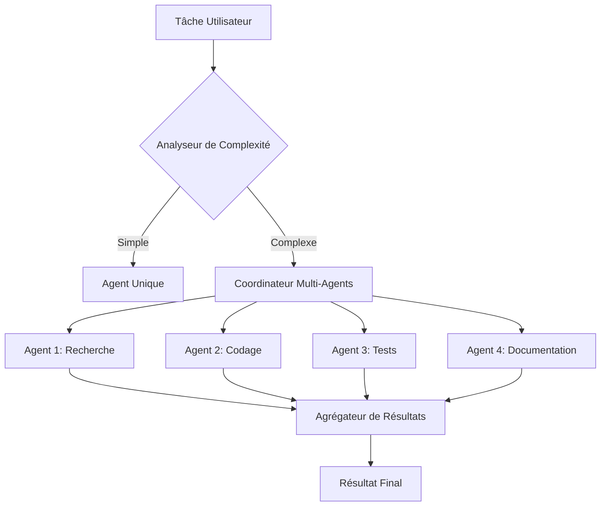

# SuperAgent - SDK d'Orchestration Multi-Agents Laravel de Niveau Entreprise 🚀

[](https://www.php.net/)
[](https://laravel.com)
[](LICENSE)
[](https://github.com/xiyanyang/superagent)

> **🌍 Langue**: [English](README.md) | [中文](README_CN.md) | [Français](README_FR.md)  
> **📖 Documentation**: [Installation Guide](INSTALL.md) | [安装手册](INSTALL_CN.md) | [Guide d'Installation](INSTALL_FR.md) | [Docs API](docs/)

SuperAgent est un SDK Laravel AI Agent de niveau entreprise puissant qui offre des capacités au niveau de Claude avec orchestration multi-agents, surveillance en temps réel et mise à l'échelle distribuée. Construisez et déployez des équipes d'agents IA qui travaillent en parallèle avec détection automatique de tâches et gestion intelligente des ressources.

## ✨ Fonctionnalités Principales

### 🆕 v0.6.9 — Correction du Chemin Base URL Guzzle
- **Correction Base URL Multi-Providers** — `OpenAIProvider`, `OpenRouterProvider` et `OllamaProvider` ajoutent maintenant correctement un slash final à `base_uri` et utilisent des chemins de requête relatifs. Auparavant, tout `base_url` personnalisé avec un préfixe de chemin (ex. `https://gateway.example.com/openai`) voyait son préfixe silencieusement supprimé par le résolveur RFC 3986 de Guzzle lors de l'utilisation d'un chemin absolu comme `/v1/chat/completions`. Les quatre providers (`AnthropicProvider` était déjà corrigé en v0.6.8) suivent maintenant le bon patron

### 🆕 v0.6.8 — Contexte Incrémental & Chargement Différé des Outils
- **Contexte Incrémental** (`IncrementalContextManager`) — Synchronisation de contexte basée sur les deltas : seul le différentiel (messages ajoutés/modifiés/supprimés) est transmis au lieu de l'historique complet. Points de contrôle automatiques, restauration en une étape, compression automatique configurable sur seuil de tokens, et API `getSmartWindow(maxTokens)` pour la récupération de contexte dans un budget de tokens
- **Chargement Paresseux du Contexte** (`LazyContextManager`) — Enregistrez des fragments de contexte avec métadonnées (type, priorité, tags, taille) sans charger leur contenu. Les fragments sont récupérés à la demande lors d'une requête de tâche, scorés par pertinence mot-clé/tag. Cache TTL, éviction LRU, `preloadPriority()`, `loadByTags()` et `getSmartWindow(maxTokens, focusArea)` pour une gestion mémoire fine
- **Chargement Différé des Outils** (`ToolLoader` / `LazyToolResolver`) — Enregistrez les classes d'outils sans les instancier ; les outils sont chargés au moment où le modèle les appelle. `predictAndPreload(task)` préchauffe les outils selon les mots-clés de la tâche. `loadForTask(task)` retourne l'ensemble minimal d'outils. Déchargez les outils inutilisés entre les tâches pour libérer de la mémoire
- **Héritage du Provider pour les Sous-Agents** — `AgentTool` reçoit désormais la config provider de l'agent parent (clé API, modèle, URL de base) et l'injecte dans chaque sous-agent via `AgentSpawnConfig::$providerConfig`. Les sous-agents créés par `InProcessBackend` sont de vraies instances `SuperAgent\Agent` avec une connexion LLM réelle
- **Repli WebSearch sans Clé** — `WebSearchTool` ne retourne plus d'erreur immédiate quand `SEARCH_API_KEY` n'est pas définie. Il se replie automatiquement sur la recherche HTML DuckDuckGo via `WebFetchTool` (cURL préféré, User-Agent niveau navigateur)
- **Renforcement WebFetch** — `WebFetchTool` préfère désormais cURL ; vérifie les codes de statut HTTP (4xx/5xx → erreur au lieu de retourner silencieusement la page d'erreur) ; message d'erreur clair quand cURL et `allow_url_fopen` sont tous les deux indisponibles

### 🆕 Orchestration Multi-Agents (v0.6.7)
- **Exécution d'Agents Parallèles** - Exécutez plusieurs agents simultanément avec suivi de progression en temps réel pour chaque agent
- **Résultats Compatibles Claude Code** - Retourne les résultats au format exact de Claude Code pour une intégration transparente
- **Détection Automatique de Tâches** - Analyse la complexité des tâches et décide automatiquement du mode agent unique vs multi-agents
- **Gestion d'Équipes d'Agents** - Coordonne les équipes avec relations leader/membre et exécution basée sur les rôles
- **Communication Inter-Agents** - Outil SendMessage pour la messagerie et coordination entre agents
- **Système de Boîte aux Lettres Persistant** - Files d'attente de messages fiables avec filtrage, archivage et diffusion
- **Agrégation de Progrès** - Comptage de tokens en temps réel, suivi d'activité et agrégation des coûts sur tous les agents
- **Surveillance WebSocket** - Tableau de bord basé sur navigateur en direct pour surveiller l'exécution d'agents parallèles
- **Pool de Ressources** - Pool d'agents intelligent avec limites de concurrence et gestion des dépendances
- **Point de Contrôle & Reprise** - Récupération automatique d'état pour les workflows multi-agents de longue durée

### 🎯 Détection de Mode Automatique
- **Analyse de Tâches Intelligente** - Détermine automatiquement si la collaboration multi-agents est nécessaire
- **Évaluation de Complexité** - Sélection automatique du mode d'exécution basée sur la complexité de la tâche
- **Optimisation des Ressources** - Agent unique pour les tâches simples, exécution parallèle multi-agents pour les tâches complexes

### 📊 Fonctionnalités Entreprise
- **Surveillance WebSocket en Temps Réel** - Tableau de bord en temps réel basé sur navigateur
- **Analyse de Performance** - Métriques de performance complètes et analyse de goulots d'étranglement
- **Gestion des Dépendances** - Orchestration de workflows complexes avec tri topologique
- **Mise à l'Échelle Distribuée** - Exécution d'agents sur plusieurs machines/processus
- **Stockage Persistant** - Sauvegarde automatique de progression, récupération après crash
- **Pool d'Agents** - Pool d'agents préchauffés pour attribution instantanée de tâches
- **Système de Modèles** - 10+ modèles préconçus pour déploiement rapide de tâches courantes

### 🔧 Ensemble d'Outils Puissants
- **59+ Outils Intégrés** - Opérations sur fichiers, édition de code, recherche web, gestion de tâches, etc.
- **Validateur de Sécurité** - 23 vérifications d'injection/obfuscation, classification de commandes
- **Compression de Contexte Intelligente** - Compression de mémoire de session avec protection des frontières sémantiques
- **Contrôle du Budget de Tokens** - Gestion dynamique du budget, contrôle intelligent des coûts

### 🌍 Support Multi-Fournisseurs
- **Claude (Anthropic)** - Dernière version Claude 4.6 incluant Opus, Sonnet et Haiku
- **OpenAI** - GPT-5.4, GPT-5, GPT-4 Turbo et modèles hérités
- **AWS Bedrock** - Claude via AWS avec support des derniers modèles
- **Ollama** - Modèles locaux incluant Llama 3, Mistral et plus
- **OpenRouter** - API unifiée pour 100+ modèles

## 📦 Installation

### Prérequis Système
- **PHP**: 8.1 ou supérieur
- **Laravel**: 10.0 ou supérieur
- **Composer**: 2.0 ou supérieur
- **Extensions PHP**: json, mbstring, curl, openssl

### Installation via Composer

```bash
composer require forgeomni/superagent
```

### Configuration Rapide

```bash
# Publier les fichiers de configuration
php artisan vendor:publish --provider="SuperAgent\SuperAgentServiceProvider"

# Configurer les variables d'environnement
cp .env.example .env
```

Ajoutez à votre fichier `.env`:

```env
# Configuration Anthropic Claude
ANTHROPIC_API_KEY=sk-ant-xxxxxxxxxxxxx
ANTHROPIC_MODEL=claude-4.6-opus-latest

# Configuration OpenAI (optionnel)
OPENAI_API_KEY=sk-xxxxxxxxxxxxx
OPENAI_MODEL=gpt-5.4
```

## 🚀 Démarrage Rapide

### Agent Basique

```php
use SuperAgent\Agent;

$agent = new Agent([
    'provider' => 'anthropic',
    'model' => 'claude-4.6-opus-latest',
]);

$result = $agent->run("Analysez ce code et suggérez des améliorations");
echo $result->message->content;
```

### Mode Multi-Agents Automatique (NOUVEAU en v0.6.7)

```php
use SuperAgent\Agent;

// Activer le mode automatique - aucune configuration nécessaire!
$agent = new Agent($provider, $config);
$agent->enableAutoMode();

// L'agent détecte automatiquement quand utiliser plusieurs agents
$result = $agent->run("
1. Rechercher les meilleures pratiques pour la conception d'API
2. Écrire une API REST avec authentification
3. Créer des tests complets
4. Documenter les points de terminaison de l'API
");

// Le résultat contient les sorties agrégées de tous les agents
echo $result->text();
echo "Coût total: $" . $result->totalCostUsd();
```

### Création Manuelle d'Équipes d'Agents

```php
use SuperAgent\Tools\Builtin\AgentTool;
use SuperAgent\Swarm\ParallelAgentCoordinator;

// Créer l'outil agent
$agentTool = new AgentTool();

// Générer plusieurs agents spécialisés
$chercheur = $agentTool->execute([
    'description' => 'Tâche de recherche',
    'prompt' => 'Rechercher les meilleures pratiques pour la conception d\'API REST',
    'subagent_type' => 'researcher',
    'run_in_background' => true,
]);

$codeur = $agentTool->execute([
    'description' => 'Implémentation de code',
    'prompt' => 'Implémenter une API REST avec authentification JWT',
    'subagent_type' => 'code-writer',
    'run_in_background' => true,
]);

// Surveiller le progrès
$coordinator = ParallelAgentCoordinator::getInstance();
$teamResult = $coordinator->collectTeamResults();

// Obtenir les résultats individuels des agents
foreach ($teamResult->getResultsByAgent() as $agentName => $result) {
    echo "Agent: $agentName\n";
    echo $result->text() . "\n";
}
```

### Communication Inter-Agents

```php
use SuperAgent\Tools\Builtin\SendMessageTool;

$messageTool = new SendMessageTool();

// Envoyer un message direct à un agent spécifique
$messageTool->execute([
    'to' => 'researcher-agent',
    'message' => 'Veuillez prioriser les meilleures pratiques de sécurité',
    'summary' => 'Mise à jour de priorité',
]);

// Diffuser à tous les agents
$messageTool->execute([
    'to' => '*',
    'message' => 'Mise à jour de l\'équipe: Concentrez-vous sur l\'optimisation des performances',
    'summary' => 'Annonce d\'équipe',
]);
```

### Surveillance WebSocket en Temps Réel

```bash
# Démarrer le serveur WebSocket
php artisan superagent:websocket

# Accéder au tableau de bord
open http://localhost:8080/superagent/monitor
```

Fonctionnalités du tableau de bord:
- 🔴 Indicateurs d'état des agents en temps réel
- 📊 Utilisation de tokens par agent
- 💰 Agrégation des coûts et suivi du budget
- 📈 Visualisation du progrès avec ETA
- 📬 Surveillance de la file d'attente des messages

## 🏗️ Architecture

### Structure du Système

```
SuperAgent/
├── Agent/              # Classes d'agents principales
├── Swarm/              # Orchestration multi-agents
│   ├── ParallelAgentCoordinator.php
│   ├── AgentMailbox.php
│   └── TeamContext.php
├── Tools/              # Outils intégrés
│   ├── AgentTool.php
│   ├── SendMessageTool.php
│   └── ...
├── Providers/          # Fournisseurs IA
├── Context/            # Gestion du contexte
├── Memory/             # Système de mémoire
└── Telemetry/          # Surveillance et métriques
```

### Flux Multi-Agents



## 📚 Documentation Avancée

### Système de Mémoire

SuperAgent maintient la mémoire de session à travers:
- **Extraction en temps réel** - Déclencheur à 3 portes (10K init, 5K croissance, 3 appels d'outils)
- **Journaux quotidiens KAIROS** - Journaux append-only
- **Consolidation auto-dream** - Consolidation nocturne en MEMORY.md

### Pensée Étendue

```php
use SuperAgent\Thinking\ThinkingConfig;

// Pensée adaptative (le modèle décide quand penser)
$agent = new Agent([
    'options' => ['thinking' => ThinkingConfig::adaptive()],
]);

// Pensée à budget fixe
$agent = new Agent([
    'options' => ['thinking' => ThinkingConfig::enabled(budgetTokens: 20000)],
]);
```

### Mode Coordinateur

Architecture double mode pour l'orchestration multi-agents complexe:

```env
# Activer le mode coordinateur
CLAUDE_CODE_COORDINATOR_MODE=1
```

Le coordinateur n'a que les outils Agent/SendMessage/TaskStop et délègue tout le travail aux agents workers isolés.

### Compétence Batch

Utiliser `/batch` pour paralléliser les changements à grande échelle:

```bash
# Dans le CLI de l'agent
/batch migrer de react vers vue
/batch remplacer toutes les utilisations de lodash par des équivalents natifs
```

Nécessite un dépôt git. Génère 5-30 agents isolés en worktree, chacun créant une PR.

## 🔐 Sécurité

### Validation des Commandes

- 23 vérifications d'injection et d'obfuscation
- Classification de commandes basée sur l'IA
- Contrôles de permission granulaires
- Isolation de l'environnement sandbox

### Modes de Permission

```php
// config/superagent.php
'permission_mode' => 'default', // Options: bypass, acceptEdits, plan, default, dontAsk, auto
```

## 📊 Performance et Mise à l'Échelle

### Optimisation

- **Pool d'agents** - Agents préchauffés pour attribution instantanée
- **Cache de contexte partagé** - Réutilisation du contexte entre agents
- **Compression intelligente** - Réduction automatique du contexte
- **Exécution parallèle** - Jusqu'à 10 agents simultanés

### Configuration de Production

```env
# Optimiser pour la production
SUPERAGENT_MAX_CONCURRENT_AGENTS=20
SUPERAGENT_AGENT_POOL_SIZE=50
SUPERAGENT_SHARED_CONTEXT_CACHE=true
SUPERAGENT_API_CONNECTION_POOL=100
```

## 🤝 Contribution

Les contributions sont les bienvenues! Veuillez consulter notre [guide de contribution](CONTRIBUTING.md).

### Développement

```bash
# Cloner le dépôt
git clone https://github.com/yourusername/superagent.git

# Installer les dépendances
composer install

# Exécuter les tests
./vendor/bin/phpunit

# Exécuter l'analyse statique
./vendor/bin/phpstan analyse
```

## 📄 Licence

SuperAgent est un logiciel open-source sous licence [MIT](LICENSE).

## 🌟 Support

- 📖 [Documentation Officielle](https://superagent-docs.example.com)
- 💬 [Forum Communautaire](https://forum.superagent.dev)
- 🐛 [Signaler un Problème](https://github.com/yourusername/superagent/issues)
- 📺 [Tutoriels Vidéo](https://youtube.com/@superagent)
- 📧 Support Email: mliz1984@gmail.com

## 🙏 Remerciements

Construit avec ❤️ par la communauté SuperAgent. Remerciements spéciaux à tous les contributeurs et utilisateurs qui ont rendu ce projet possible.

---

© 2024-2026 SuperAgent. Tous droits réservés.