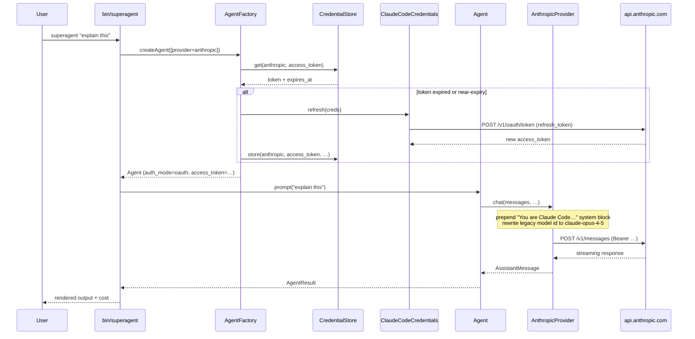
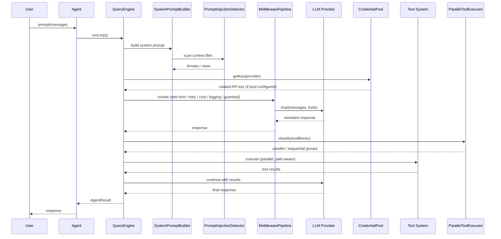

# SuperAgent Architecture — Dependency Graph

> **Version:** 0.8.6 | **Auto-generated:** 2026-04-14

> **Language**: [English](ARCHITECTURE.md) | [中文](ARCHITECTURE_CN.md) | [Français](ARCHITECTURE_FR.md)

## Core System Dependencies

```mermaid
%%{init: {'flowchart': {'rankSpacing': 60, 'nodeSpacing': 30}}}%%
graph TB
    subgraph Entry["Entry Points"]
        CLI["bin/superagent<br/>(v0.8.6)"]
        Agent["Agent.php"]
        HarnessLoop["HarnessLoop"]
        Bridge["Bridge HTTP Proxy"]
    end

    subgraph CLIStack["CLI (v0.8.5 + v0.8.6)"]
        SAA["SuperAgentApplication"]
        AF["AgentFactory"]
        CC_CMD["ChatCommand"]
        IC_CMD["InitCommand"]
        AC_CMD["AuthCommand"]
        RTR["RealTimeCliRenderer"]
        LR["Renderer (legacy)"]
    end

    subgraph Auth["Auth (v0.8.6)"]
        CS["CredentialStore"]
        CCC["ClaudeCodeCredentials"]
        CXC["CodexCredentials"]
        TR["TokenResponse"]
        DCF["DeviceCodeFlow"]
    end

    subgraph Foundation["Foundation (v0.8.5 + v0.8.6)"]
        FA["Application<br/>(container)"]
        CR["ConfigRepository"]
        HLP["helpers.php<br/>(config/app/storage_path)"]
    end

    subgraph Core["Core Engine"]
        QE["QueryEngine<br/>(930 lines)"]
        SPB["SystemPromptBuilder"]
        MR["ModelResolver"]
    end

    subgraph Providers["LLM Providers"]
        PR["ProviderRegistry"]
        CP["CredentialPool"]
        AP["AnthropicProvider"]
        OP["OpenAIProvider"]
        ORP["OpenRouterProvider"]
        BP["BedrockProvider"]
        OLP["OllamaProvider"]
        FP["FallbackProvider"]
        RM["RetryMiddleware"]
    end

    subgraph Tools["Tool System"]
        TL["ToolLoader"]
        BTR["BuiltinToolRegistry<br/>(65 tools)"]
        TNR["ToolNameResolver"]
        TSM["ToolStateManager"]
        TSF["ToolSchemaFilter"]
    end

    subgraph Optimization["Optimization (v0.7.0+v0.8.0)"]
        TRC["ToolResultCompactor"]
        CC["ContextCompressor<br/>(v0.8.0)"]
        MRt["ModelRouter"]
        QCR["QueryComplexityRouter<br/>(v0.8.0)"]
        RP["ResponsePrefill"]
        PCP["PromptCachePinning"]
    end

    subgraph Performance["Performance"]
        PTE["ParallelToolExecutor<br/>(path-aware v0.8.0)"]
        STD["StreamingToolDispatch"]
        SP["SpeculativePrefetch"]
        AMT["AdaptiveMaxTokens"]
        CPool["ConnectionPool"]
    end

    subgraph Security["Security & Guardrails"]
        BSV["BashSecurityValidator<br/>(23 checks)"]
        SCC["SecurityCheckChain<br/>(v0.8.0)"]
        GE["GuardrailsEngine"]
        PID["PromptInjectionDetector<br/>(v0.8.0)"]
        PE["PermissionEngine"]
        PRE["PathRuleEvaluator"]
    end

    subgraph Memory["Memory System (v0.8.0 + v0.8.5)"]
        MPI["MemoryProviderInterface"]
        MPM["MemoryProviderManager"]
        BMP["BuiltinMemoryProvider"]
        MS["MemoryStorage"]
        ME["MemoryExtractor"]
        MRv["MemoryRetriever"]
        ADC["AutoDreamConsolidator"]
        DL["DailyLog (KAIROS)"]
        SME["SessionMemoryExtractor"]
        PMP["PalaceMemoryProvider<br/>(v0.8.5)"]
        PS["PalaceStorage<br/>(v0.8.5)"]
        PR_["PalaceRetriever<br/>(v0.8.5)"]
        PG["PalaceGraph<br/>(v0.8.5)"]
        LM["LayerManager<br/>(L0/L1/L2/L3)"]
    end

    subgraph Coord["Coordinator (v0.8.2)"]
        COLP["CollaborationPipeline"]
        TRT["TaskRouter"]
        PCI["PhaseContextInjector"]
        ARP["AgentRetryPolicy"]
        PPE["ParallelPhaseExecutor"]
    end

    subgraph MW["Middleware (v0.8.1)"]
        MWP["MiddlewarePipeline"]
        RLM["RateLimitMiddleware"]
        CTM["CostTrackingMiddleware"]
        LgM["LoggingMiddleware"]
        GdM["GuardrailMiddleware"]
    end

    subgraph Session["Session (v0.8.0)"]
        SM["SessionManager"]
        SS["SessionStorage (files)"]
        SPS["SessionPruner"]
        SQS["SqliteSessionStorage<br/>(WAL+FTS5 v0.8.0)"]
    end

    subgraph Swarm["Multi-Agent Orchestration"]
        PAC["ParallelAgentCoordinator"]
        AT["AgentTool"]
        PB["ProcessBackend"]
        IPB["InProcessBackend"]
        TB["TmuxBackend"]
        ITB["ITermBackend"]
        DB["DistributedBackend"]
        ADM["AgentDependencyManager"]
        ACP["AgentCommunicationProtocol"]
        APP["AgentPerformanceProfiler"]
        TC["TeamContext"]
    end

    subgraph Intelligence["Intelligence"]
        SCM["SmartContextManager"]
        KG["KnowledgeGraph"]
        AF["AdaptiveFeedback"]
        CA["CostAutopilot"]
        CPred["CostPredictor"]
        SD["DistillationEngine"]
    end

    subgraph Pipeline["Pipeline & Workflow"]
        PEng["PipelineEngine"]
        SH["SelfHealingStrategy"]
        DO["DebateOrchestrator"]
        FM["ForkManager"]
        RR["ReplayRecorder"]
    end

    subgraph Infra["Infrastructure"]
        MCP["MCPManager"]
        PM["PluginManager"]
        SKM["SkillManager"]
        SKC["SkillCatalogTool<br/>(v0.8.0)"]
        HR["HookRegistry"]
        HRL["HookReloader"]
        PH["PromptHook"]
        CM["ChannelManager"]
        AS["AppStateStore"]
        SSW["SafeStreamWriter<br/>(v0.8.0)"]
    end

    %% CLI entry
    CLI --> SAA
    SAA --> CC_CMD
    SAA --> IC_CMD
    SAA --> AC_CMD
    CC_CMD --> AF
    AC_CMD --> CS
    AF --> Agent
    AF --> HarnessLoop
    AF --> CS
    CS --> CCC
    CS --> CXC
    CLI --> FA
    FA --> CR
    HarnessLoop --> RTR
    HarnessLoop --> LR

    %% Core flow
    Agent --> QE
    HarnessLoop --> QE
    Agent --> MR
    Agent --> PR
    QE --> SPB
    QE --> TL
    QE --> PTE

    %% Provider chain
    PR --> CP
    PR --> AP
    PR --> OP
    PR --> ORP
    PR --> BP
    PR --> OLP
    PR --> FP
    CP -.->|key rotation| AP
    CP -.->|key rotation| OP
    RM -.->|wraps| AP
    RM -.->|wraps| OP
    CS -.->|OAuth/API key v0.8.6| AP
    CS -.->|OAuth/API key v0.8.6| OP
    CCC --> CS
    CXC --> CS

    %% Tools
    TL --> BTR
    TL --> TNR
    BTR --> TSM
    QE --> TSF

    %% Optimization
    QE --> TRC
    QE --> CC
    QE --> MRt
    QE --> QCR
    QE --> RP
    SPB --> PCP

    %% Security
    SPB --> PID
    QE --> GE
    QE --> PE
    PE --> PRE
    GE --> BSV
    BSV -.-> SCC

    %% Memory
    MPM --> BMP
    MPM --> MPI
    MPM -.->|external| PMP
    BMP --> MS
    BMP --> MRv
    BMP --> ME
    ADC --> MS
    ADC --> DL
    SPB --> MPM
    PMP --> PS
    PMP --> PR_
    PR_ --> PG
    PMP --> LM
    LM --> KG

    %% Coordinator
    COLP --> TRT
    COLP --> PCI
    COLP --> PPE
    COLP --> ARP
    PPE --> PB
    PPE --> IPB

    %% Middleware
    QE --> MWP
    MWP --> RLM
    MWP --> RM
    MWP --> CTM
    MWP --> LgM
    MWP --> GdM
    GdM --> GE

    %% Session
    SM --> SS
    SM --> SPS
    SM --> SQS

    %% Swarm
    AT --> PAC
    AT --> PB
    AT --> IPB
    PAC --> TC
    PAC --> ADM
    PAC --> ACP
    PAC --> APP
    PB --> DB
    PB --> TB
    PB --> ITB

    %% Intelligence
    QE --> SCM
    QE --> KG
    QE --> CA
    CA --> CPred
    QE --> AF

    %% Pipeline
    PEng --> SH
    PEng --> QE

    %% Infra
    SPB -.->|scan context files| PID
    QE --> MCP
    QE --> HR
    HR --> HRL
    HR --> PH
    PM --> SKM
    SKM --> SKC

    %% Styles
    classDef new fill:#e1f5fe,stroke:#0288d1,stroke-width:2px
    classDef core fill:#fff3e0,stroke:#f57c00,stroke-width:2px
    classDef security fill:#fce4ec,stroke:#c62828,stroke-width:2px

    class CC,QCR,PID,SCC,CP,MPM,MPI,BMP,SQS,SKC,SSW,ADM,CLI,SAA,AF,CC_CMD,IC_CMD,AC_CMD,RTR,LR,CS,CCC,CXC,TR,DCF,FA,CR,HLP,PMP,PS,PR_,PG,LM,COLP,TRT,PCI,ARP,PPE,MWP,RLM,CTM,LgM,GdM new
    class QE,Agent,HarnessLoop,CLI core
    class BSV,GE,PID,PE,PRE security
```

## Subsystem Counts (v0.8.6)

| Category | Files | Lines | Δ since v0.8.0 |
|----------|-------|-------|----------------|
| Core (Agent, QueryEngine, Prompt) | 12 | ~2,600 | — |
| **CLI + Console + Auth (NEW)** | **17** | **~2,687** | **NEW (v0.8.5 + v0.8.6)** |
| **Foundation (NEW)** | **2** | **~550** | **NEW (v0.8.5 + v0.8.6)** |
| Providers (OAuth-aware) | 12 | ~3,800 | +~100 (OAuth paths) |
| Tools | 74 | ~11,300 | — |
| Optimization | 8 | ~2,100 | — |
| Performance | 8 | ~2,100 | — |
| Security & Guardrails | 33 | ~3,200 | — |
| Memory (incl. **Palace**) | 42 | ~5,400 | **+2,289 (Palace v0.8.5)** |
| Session | 4 | ~1,600 | — |
| Swarm & Orchestration | 34 | ~7,300 | — |
| **Coordinator (NEW)** | **14** | **~2,800** | **NEW (v0.8.2)** |
| Harness | 21 | ~1,800 | — |
| **Middleware (NEW)** | **7** | **~900** | **NEW (v0.8.1)** |
| Intelligence | 20 | ~3,500 | — |
| Pipeline | 24 | ~3,764 | — |
| Infrastructure | 40 | ~5,000 | — |
| **Total** | **566** | **~93,395** | **+70 files / +12,159 lines** |

## Data Flow

### CLI one-shot request (v0.8.6 OAuth path)

### Core request flow (Laravel or CLI, api_key or OAuth)

## Key Design Decisions

1. **Dual-deployment architecture (v0.8.6)**: Laravel package + standalone CLI binary share the same `Agent` / `HarnessLoop` / `CommandRouter` / `MemoryProviderManager` / `SessionManager`. Adaptation happens at the boundary (polyfilled `config()`/`app()`/`storage_path()` + `Foundation\Application` minimal container that mirrors Laravel's bind/singleton/make API)
2. **OAuth credential import (v0.8.6)**: `src/Auth/` reads existing Claude Code / Codex local tokens and plugs them into provider Bearer mode. Refresh is transparent; provider auto-injects Claude Code identity system block; legacy model ids silently rewritten
3. **Memory Palace as external provider (v0.8.5)**: Plugs into `MemoryProviderManager` as a second provider alongside the builtin `MEMORY.md` flow. Wings/Halls/Rooms/Drawers + Tunnels + 4-layer stack (L0 Identity / L1 Critical Facts / L2 Room Recall / L3 Deep Search). Auto-tunnels created when the same Room appears across multiple Wings
4. **Collaboration Pipeline (v0.8.2)**: Phased multi-agent DAG with topological ordering, 4 failure strategies, 8-event lifecycle listeners. Phases execute agents in true parallel via `ParallelPhaseExecutor` + `ProcessBackend` / `InProcessBackend`
5. **Middleware onion (v0.8.1)**: `MiddlewarePipeline` composes rate-limit + retry + cost-tracking + logging + guardrail middleware around every provider call, priority-ordered
6. **Dual-write sessions (v0.8.0)**: File (backward compat) + SQLite (search). Graceful fallback if SQLite unavailable
7. **Path-aware parallelism (v0.8.0)**: Write tools classified by target path, not just read-only flag
8. **Memory provider isolation**: External provider errors never crash the agent
9. **Credential rotation (v0.8.0) + OAuth bearer (v0.8.6)**: Both integrated at `ProviderRegistry` level — transparent to all consumers
10. **Prompt injection scanning**: Integrated into `SystemPromptBuilder` — auto-scans context files on `withContextFiles()`
11. **Progressive skill loading**: Two-phase (metadata → full content) to minimize token overhead
12. **`SecurityCheckChain`**: Wraps existing 23-check validator while enabling custom check insertion
