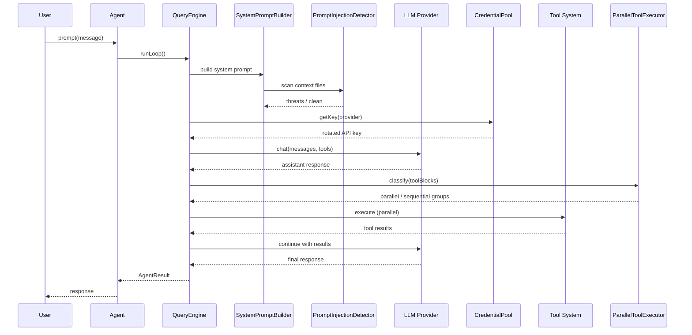

# SuperAgent Architecture — Dependency Graph

> **Version:** 0.8.0 | **Auto-generated:** 2026-04-08

> **Language**: [English](ARCHITECTURE.md) | [中文](ARCHITECTURE_CN.md) | [Français](ARCHITECTURE_FR.md)

## Core System Dependencies

```mermaid
graph TB
    subgraph Entry["Entry Points"]
        Agent["Agent.php"]
        HarnessLoop["HarnessLoop"]
        Bridge["Bridge HTTP Proxy"]
    end

    subgraph Core["Core Engine"]
        QE["QueryEngine<br/>(930 lines)"]
        SPB["SystemPromptBuilder"]
        MR["ModelResolver"]
    end

    subgraph Providers["LLM Providers"]
        PR["ProviderRegistry"]
        CP["CredentialPool"]
        AP["AnthropicProvider"]
        OP["OpenAIProvider"]
        ORP["OpenRouterProvider"]
        BP["BedrockProvider"]
        OLP["OllamaProvider"]
        FP["FallbackProvider"]
        RM["RetryMiddleware"]
    end

    subgraph Tools["Tool System"]
        TL["ToolLoader"]
        BTR["BuiltinToolRegistry<br/>(65 tools)"]
        TNR["ToolNameResolver"]
        TSM["ToolStateManager"]
        TSF["ToolSchemaFilter"]
    end

    subgraph Optimization["Optimization (v0.7.0+v0.8.0)"]
        TRC["ToolResultCompactor"]
        CC["ContextCompressor<br/>(v0.8.0)"]
        MRt["ModelRouter"]
        QCR["QueryComplexityRouter<br/>(v0.8.0)"]
        RP["ResponsePrefill"]
        PCP["PromptCachePinning"]
    end

    subgraph Performance["Performance"]
        PTE["ParallelToolExecutor<br/>(path-aware v0.8.0)"]
        STD["StreamingToolDispatch"]
        SP["SpeculativePrefetch"]
        AMT["AdaptiveMaxTokens"]
        CPool["ConnectionPool"]
    end

    subgraph Security["Security & Guardrails"]
        BSV["BashSecurityValidator<br/>(23 checks)"]
        SCC["SecurityCheckChain<br/>(v0.8.0)"]
        GE["GuardrailsEngine"]
        PID["PromptInjectionDetector<br/>(v0.8.0)"]
        PE["PermissionEngine"]
        PRE["PathRuleEvaluator"]
    end

    subgraph Memory["Memory System (v0.8.0)"]
        MPI["MemoryProviderInterface"]
        MPM["MemoryProviderManager"]
        BMP["BuiltinMemoryProvider"]
        MS["MemoryStorage"]
        ME["MemoryExtractor"]
        MRv["MemoryRetriever"]
        ADC["AutoDreamConsolidator"]
        DL["DailyLog (KAIROS)"]
        SME["SessionMemoryExtractor"]
    end

    subgraph Session["Session (v0.8.0)"]
        SM["SessionManager"]
        SS["SessionStorage (files)"]
        SPS["SessionPruner"]
        SQS["SqliteSessionStorage<br/>(WAL+FTS5 v0.8.0)"]
    end

    subgraph Swarm["Multi-Agent Orchestration"]
        PAC["ParallelAgentCoordinator"]
        AT["AgentTool"]
        PB["ProcessBackend"]
        IPB["InProcessBackend"]
        TB["TmuxBackend"]
        ITB["ITermBackend"]
        DB["DistributedBackend"]
        ADM["AgentDependencyManager"]
        ACP["AgentCommunicationProtocol"]
        APP["AgentPerformanceProfiler"]
        TC["TeamContext"]
    end

    subgraph Intelligence["Intelligence"]
        SCM["SmartContextManager"]
        KG["KnowledgeGraph"]
        AF["AdaptiveFeedback"]
        CA["CostAutopilot"]
        CPred["CostPredictor"]
        SD["DistillationEngine"]
    end

    subgraph Pipeline["Pipeline & Workflow"]
        PEng["PipelineEngine"]
        SH["SelfHealingStrategy"]
        DO["DebateOrchestrator"]
        FM["ForkManager"]
        RR["ReplayRecorder"]
    end

    subgraph Infra["Infrastructure"]
        MCP["MCPManager"]
        PM["PluginManager"]
        SKM["SkillManager"]
        SKC["SkillCatalogTool<br/>(v0.8.0)"]
        HR["HookRegistry"]
        HRL["HookReloader"]
        PH["PromptHook"]
        CM["ChannelManager"]
        AS["AppStateStore"]
        SSW["SafeStreamWriter<br/>(v0.8.0)"]
    end

    %% Core flow
    Agent --> QE
    HarnessLoop --> QE
    Agent --> MR
    Agent --> PR
    QE --> SPB
    QE --> TL
    QE --> PTE

    %% Provider chain
    PR --> CP
    PR --> AP
    PR --> OP
    PR --> ORP
    PR --> BP
    PR --> OLP
    PR --> FP
    CP -.->|key rotation| AP
    CP -.->|key rotation| OP
    RM -.->|wraps| AP
    RM -.->|wraps| OP

    %% Tools
    TL --> BTR
    TL --> TNR
    BTR --> TSM
    QE --> TSF

    %% Optimization
    QE --> TRC
    QE --> CC
    QE --> MRt
    QE --> QCR
    QE --> RP
    SPB --> PCP

    %% Security
    SPB --> PID
    QE --> GE
    QE --> PE
    PE --> PRE
    GE --> BSV
    BSV -.-> SCC

    %% Memory
    MPM --> BMP
    MPM --> MPI
    BMP --> MS
    BMP --> MRv
    BMP --> ME
    ADC --> MS
    ADC --> DL
    SPB --> MPM

    %% Session
    SM --> SS
    SM --> SPS
    SM --> SQS

    %% Swarm
    AT --> PAC
    AT --> PB
    AT --> IPB
    PAC --> TC
    PAC --> ADM
    PAC --> ACP
    PAC --> APP
    PB --> DB
    PB --> TB
    PB --> ITB

    %% Intelligence
    QE --> SCM
    QE --> KG
    QE --> CA
    CA --> CPred
    QE --> AF

    %% Pipeline
    PEng --> SH
    PEng --> QE

    %% Infra
    SPB -.->|scan context files| PID
    QE --> MCP
    QE --> HR
    HR --> HRL
    HR --> PH
    PM --> SKM
    SKM --> SKC

    %% Styles
    classDef new fill:#e1f5fe,stroke:#0288d1,stroke-width:2px
    classDef core fill:#fff3e0,stroke:#f57c00,stroke-width:2px
    classDef security fill:#fce4ec,stroke:#c62828,stroke-width:2px

    class CC,QCR,PID,SCC,CP,MPM,MPI,BMP,SQS,SKC,SSW,ADM new
    class QE,Agent,HarnessLoop core
    class BSV,GE,PID,PE,PRE security
```

## Subsystem Counts

| Category | Directories | Files | Lines |
|----------|-------------|-------|-------|
| Core (Agent, QueryEngine, Prompt) | 3 | 12 | ~2,500 |
| Providers | 1 | 10 | ~3,700 |
| Tools | 2 | 74 | ~11,300 |
| Optimization | 2 | 8 | ~2,100 |
| Performance | 1 | 8 | ~2,100 |
| Security & Guardrails | 2 | 33 | ~3,200 |
| Memory | 3 | 14 | ~3,100 |
| Session | 1 | 4 | ~1,600 |
| Swarm & Orchestration | 8 | 34 | ~7,300 |
| Intelligence | 6 | 20 | ~3,500 |
| Pipeline | 2 | 24 | ~3,764 |
| Infrastructure | 10 | 40 | ~5,000 |
| **Total** | **91** | **496** | **~81,236** |

## Data Flow

## Key Design Decisions

1. **Dual-write sessions**: File (backward compat) + SQLite (search). Graceful fallback if SQLite unavailable
2. **Path-aware parallelism**: Write tools classified by target path, not just read-only flag
3. **Memory provider isolation**: External provider errors never crash the agent
4. **Credential rotation**: Pool integrated at ProviderRegistry level — transparent to all consumers
5. **Prompt injection scanning**: Integrated into SystemPromptBuilder — auto-scans context files on `withContextFiles()`
6. **Progressive skill loading**: Two-phase (metadata → full content) to minimize token overhead
7. **SecurityCheckChain**: Wraps existing 23-check validator while enabling custom check insertion
