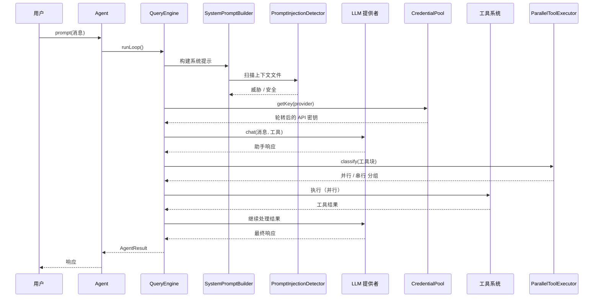

# SuperAgent 架构 — 依赖关系图

> **版本:** 0.8.0 | **生成日期:** 2026-04-08

> **语言**: [English](ARCHITECTURE.md) | [中文](ARCHITECTURE_CN.md) | [Français](ARCHITECTURE_FR.md)

## 核心系统依赖

```mermaid
graph TB
    subgraph Entry["入口点"]
        Agent["Agent.php"]
        HarnessLoop["HarnessLoop"]
        Bridge["Bridge HTTP 代理"]
    end

    subgraph Core["核心引擎"]
        QE["QueryEngine<br/>(930 行)"]
        SPB["SystemPromptBuilder"]
        MR["ModelResolver"]
    end

    subgraph Providers["LLM 提供者"]
        PR["ProviderRegistry"]
        CP["CredentialPool"]
        AP["AnthropicProvider"]
        OP["OpenAIProvider"]
        ORP["OpenRouterProvider"]
        BP["BedrockProvider"]
        OLP["OllamaProvider"]
        FP["FallbackProvider"]
        RM["RetryMiddleware"]
    end

    subgraph Tools["工具系统"]
        TL["ToolLoader"]
        BTR["BuiltinToolRegistry<br/>(65 个工具)"]
        TNR["ToolNameResolver"]
        TSM["ToolStateManager"]
        TSF["ToolSchemaFilter"]
    end

    subgraph Optimization["优化 (v0.7.0+v0.8.0)"]
        TRC["ToolResultCompactor"]
        CC["ContextCompressor<br/>(v0.8.0)"]
        MRt["ModelRouter"]
        QCR["QueryComplexityRouter<br/>(v0.8.0)"]
        RP["ResponsePrefill"]
        PCP["PromptCachePinning"]
    end

    subgraph Performance["性能"]
        PTE["ParallelToolExecutor<br/>(路径感知 v0.8.0)"]
        STD["StreamingToolDispatch"]
        SP["SpeculativePrefetch"]
        AMT["AdaptiveMaxTokens"]
        CPool["ConnectionPool"]
    end

    subgraph Security["安全与护栏"]
        BSV["BashSecurityValidator<br/>(23 项检查)"]
        SCC["SecurityCheckChain<br/>(v0.8.0)"]
        GE["GuardrailsEngine"]
        PID["PromptInjectionDetector<br/>(v0.8.0)"]
        PE["PermissionEngine"]
        PRE["PathRuleEvaluator"]
    end

    subgraph Memory["记忆系统 (v0.8.0)"]
        MPI["MemoryProviderInterface"]
        MPM["MemoryProviderManager"]
        BMP["BuiltinMemoryProvider"]
        MS["MemoryStorage"]
        ME["MemoryExtractor"]
        MRv["MemoryRetriever"]
        ADC["AutoDreamConsolidator"]
        DL["DailyLog (KAIROS)"]
        SME["SessionMemoryExtractor"]
    end

    subgraph Session["会话 (v0.8.0)"]
        SM["SessionManager"]
        SS["SessionStorage (文件)"]
        SPS["SessionPruner"]
        SQS["SqliteSessionStorage<br/>(WAL+FTS5 v0.8.0)"]
    end

    subgraph Swarm["多智能体编排"]
        PAC["ParallelAgentCoordinator"]
        AT["AgentTool"]
        PB["ProcessBackend"]
        IPB["InProcessBackend"]
        TB["TmuxBackend"]
        ITB["ITermBackend"]
        DB["DistributedBackend"]
        ADM["AgentDependencyManager"]
        ACP["AgentCommunicationProtocol"]
        APP["AgentPerformanceProfiler"]
        TC["TeamContext"]
    end

    subgraph Intelligence["智能"]
        SCM["SmartContextManager"]
        KG["KnowledgeGraph"]
        AF["AdaptiveFeedback"]
        CA["CostAutopilot"]
        CPred["CostPredictor"]
        SD["DistillationEngine"]
    end

    subgraph Pipeline["流水线与工作流"]
        PEng["PipelineEngine"]
        SH["SelfHealingStrategy"]
        DO["DebateOrchestrator"]
        FM["ForkManager"]
        RR["ReplayRecorder"]
    end

    subgraph Infra["基础设施"]
        MCP["MCPManager"]
        PM["PluginManager"]
        SKM["SkillManager"]
        SKC["SkillCatalogTool<br/>(v0.8.0)"]
        HR["HookRegistry"]
        HRL["HookReloader"]
        PH["PromptHook"]
        CM["ChannelManager"]
        AS["AppStateStore"]
        SSW["SafeStreamWriter<br/>(v0.8.0)"]
    end

    %% 核心流程
    Agent --> QE
    HarnessLoop --> QE
    Agent --> MR
    Agent --> PR
    QE --> SPB
    QE --> TL
    QE --> PTE

    %% 提供者链
    PR --> CP
    PR --> AP
    PR --> OP
    PR --> ORP
    PR --> BP
    PR --> OLP
    PR --> FP
    CP -.->|密钥轮转| AP
    CP -.->|密钥轮转| OP
    RM -.->|包裹| AP
    RM -.->|包裹| OP

    %% 工具
    TL --> BTR
    TL --> TNR
    BTR --> TSM
    QE --> TSF

    %% 优化
    QE --> TRC
    QE --> CC
    QE --> MRt
    QE --> QCR
    QE --> RP
    SPB --> PCP

    %% 安全
    SPB --> PID
    QE --> GE
    QE --> PE
    PE --> PRE
    GE --> BSV
    BSV -.-> SCC

    %% 记忆
    MPM --> BMP
    MPM --> MPI
    BMP --> MS
    BMP --> MRv
    BMP --> ME
    ADC --> MS
    ADC --> DL
    SPB --> MPM

    %% 会话
    SM --> SS
    SM --> SPS
    SM --> SQS

    %% 多智能体
    AT --> PAC
    AT --> PB
    AT --> IPB
    PAC --> TC
    PAC --> ADM
    PAC --> ACP
    PAC --> APP
    PB --> DB
    PB --> TB
    PB --> ITB

    %% 智能
    QE --> SCM
    QE --> KG
    QE --> CA
    CA --> CPred
    QE --> AF

    %% 流水线
    PEng --> SH
    PEng --> QE

    %% 基础设施
    SPB -.->|扫描上下文文件| PID
    QE --> MCP
    QE --> HR
    HR --> HRL
    HR --> PH
    PM --> SKM
    SKM --> SKC

    classDef new fill:#e1f5fe,stroke:#0288d1,stroke-width:2px
    classDef core fill:#fff3e0,stroke:#f57c00,stroke-width:2px
    classDef security fill:#fce4ec,stroke:#c62828,stroke-width:2px

    class CC,QCR,PID,SCC,CP,MPM,MPI,BMP,SQS,SKC,SSW,ADM new
    class QE,Agent,HarnessLoop core
    class BSV,GE,PID,PE,PRE security
```

## 子系统统计

| 分类 | 目录数 | 文件数 | 行数 |
|------|--------|--------|------|
| 核心（Agent, QueryEngine, Prompt） | 3 | 12 | ~2,500 |
| 提供者 | 1 | 10 | ~3,700 |
| 工具 | 2 | 74 | ~11,300 |
| 优化 | 2 | 8 | ~2,100 |
| 性能 | 1 | 8 | ~2,100 |
| 安全与护栏 | 2 | 33 | ~3,200 |
| 记忆 | 3 | 14 | ~3,100 |
| 会话 | 1 | 4 | ~1,600 |
| 多智能体编排 | 8 | 34 | ~7,300 |
| 智能 | 6 | 20 | ~3,500 |
| 流水线 | 2 | 24 | ~3,764 |
| 基础设施 | 10 | 40 | ~5,000 |
| **总计** | **91** | **496** | **~81,236** |

## 数据流

## 关键设计决策

1. **双写会话**：文件（向后兼容）+ SQLite（搜索）。SQLite 不可用时优雅降级
2. **路径感知并行**：写工具按目标路径分类，而非仅按只读标志
3. **记忆提供者隔离**：外部提供者错误永远不会导致 Agent 崩溃
4. **凭证轮转**：池在 ProviderRegistry 层集成 — 对所有消费者透明
5. **Prompt 注入扫描**：集成到 SystemPromptBuilder — 在 `withContextFiles()` 时自动扫描上下文文件
6. **渐进式技能加载**：两阶段（元数据 → 完整内容）最小化 token 开销
7. **SecurityCheckChain**：包裹现有 23 项检查验证器，同时支持自定义检查插入
