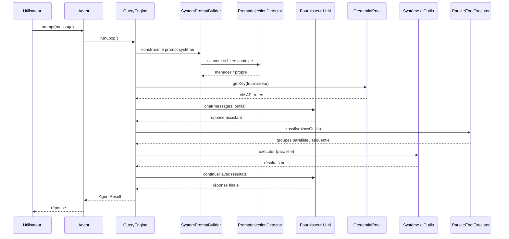

# SuperAgent Architecture — Graphe de Dépendances

> **Version :** 0.8.0 | **Généré le :** 2026-04-08

> **Langue** : [English](ARCHITECTURE.md) | [中文](ARCHITECTURE_CN.md) | [Français](ARCHITECTURE_FR.md)

## Dépendances du Système Principal

```mermaid
%%{init: {'flowchart': {'rankSpacing': 60, 'nodeSpacing': 30}}}%%
graph TB
    subgraph Entry["Points d'Entrée"]
        Agent["Agent.php"]
        HarnessLoop["HarnessLoop"]
        Bridge["Bridge HTTP Proxy"]
    end

    subgraph Core["Moteur Principal"]
        QE["QueryEngine<br/>(930 lignes)"]
        SPB["SystemPromptBuilder"]
        MR["ModelResolver"]
    end

    subgraph Providers["Fournisseurs LLM"]
        PR["ProviderRegistry"]
        CP["CredentialPool"]
        AP["AnthropicProvider"]
        OP["OpenAIProvider"]
        ORP["OpenRouterProvider"]
        BP["BedrockProvider"]
        OLP["OllamaProvider"]
        FP["FallbackProvider"]
        RM["RetryMiddleware"]
    end

    subgraph Tools["Système d'Outils"]
        TL["ToolLoader"]
        BTR["BuiltinToolRegistry<br/>(65 outils)"]
        TNR["ToolNameResolver"]
        TSM["ToolStateManager"]
        TSF["ToolSchemaFilter"]
    end

    subgraph Optimization["Optimisation (v0.7.0+v0.8.0)"]
        TRC["ToolResultCompactor"]
        CC["ContextCompressor<br/>(v0.8.0)"]
        MRt["ModelRouter"]
        QCR["QueryComplexityRouter<br/>(v0.8.0)"]
        RP["ResponsePrefill"]
        PCP["PromptCachePinning"]
    end

    subgraph Performance["Performance"]
        PTE["ParallelToolExecutor<br/>(chemins v0.8.0)"]
        STD["StreamingToolDispatch"]
        SP["SpeculativePrefetch"]
        AMT["AdaptiveMaxTokens"]
        CPool["ConnectionPool"]
    end

    subgraph Security["Sécurité & Guardrails"]
        BSV["BashSecurityValidator<br/>(23 checks)"]
        SCC["SecurityCheckChain<br/>(v0.8.0)"]
        GE["GuardrailsEngine"]
        PID["PromptInjectionDetector<br/>(v0.8.0)"]
        PE["PermissionEngine"]
        PRE["PathRuleEvaluator"]
    end

    subgraph Memory["Système de Mémoire (v0.8.0)"]
        MPI["MemoryProviderInterface"]
        MPM["MemoryProviderManager"]
        BMP["BuiltinMemoryProvider"]
        MS["MemoryStorage"]
        ME["MemoryExtractor"]
        MRv["MemoryRetriever"]
        ADC["AutoDreamConsolidator"]
        DL["DailyLog (KAIROS)"]
        SME["SessionMemoryExtractor"]
    end

    subgraph Session["Session (v0.8.0)"]
        SM["SessionManager"]
        SS["SessionStorage (fichiers)"]
        SPS["SessionPruner"]
        SQS["SqliteSessionStorage<br/>(WAL+FTS5 v0.8.0)"]
    end

    subgraph Swarm["Orchestration Multi-Agents"]
        PAC["ParallelAgentCoordinator"]
        AT["AgentTool"]
        PB["ProcessBackend"]
        IPB["InProcessBackend"]
        TB["TmuxBackend"]
        ITB["ITermBackend"]
        DB["DistributedBackend"]
        ADM["AgentDependencyManager"]
        ACP["AgentCommunicationProtocol"]
        APP["AgentPerformanceProfiler"]
        TC["TeamContext"]
    end

    subgraph Intelligence["Intelligence"]
        SCM["SmartContextManager"]
        KG["KnowledgeGraph"]
        AF["AdaptiveFeedback"]
        CA["CostAutopilot"]
        CPred["CostPredictor"]
        SD["DistillationEngine"]
    end

    subgraph Pipeline["Pipeline & Workflow"]
        PEng["PipelineEngine"]
        SH["SelfHealingStrategy"]
        DO["DebateOrchestrator"]
        FM["ForkManager"]
        RR["ReplayRecorder"]
    end

    subgraph Infra["Infrastructure"]
        MCP["MCPManager"]
        PM["PluginManager"]
        SKM["SkillManager"]
        SKC["SkillCatalogTool<br/>(v0.8.0)"]
        HR["HookRegistry"]
        HRL["HookReloader"]
        PH["PromptHook"]
        CM["ChannelManager"]
        AS["AppStateStore"]
        SSW["SafeStreamWriter<br/>(v0.8.0)"]
    end

    Agent --> QE
    HarnessLoop --> QE
    Agent --> MR
    Agent --> PR
    QE --> SPB
    QE --> TL
    QE --> PTE

    PR --> CP
    PR --> AP
    PR --> OP
    PR --> ORP
    PR --> BP
    PR --> OLP
    PR --> FP
    CP -.->|rotation clés| AP
    CP -.->|rotation clés| OP
    RM -.->|enveloppe| AP
    RM -.->|enveloppe| OP

    TL --> BTR
    TL --> TNR
    BTR --> TSM
    QE --> TSF

    QE --> TRC
    QE --> CC
    QE --> MRt
    QE --> QCR
    QE --> RP
    SPB --> PCP

    SPB --> PID
    QE --> GE
    QE --> PE
    PE --> PRE
    GE --> BSV
    BSV -.-> SCC

    MPM --> BMP
    MPM --> MPI
    BMP --> MS
    BMP --> MRv
    BMP --> ME
    ADC --> MS
    ADC --> DL
    SPB --> MPM

    SM --> SS
    SM --> SPS
    SM --> SQS

    AT --> PAC
    AT --> PB
    AT --> IPB
    PAC --> TC
    PAC --> ADM
    PAC --> ACP
    PAC --> APP
    PB --> DB
    PB --> TB
    PB --> ITB

    QE --> SCM
    QE --> KG
    QE --> CA
    CA --> CPred
    QE --> AF

    PEng --> SH
    PEng --> QE

    SPB -.->|scan fichiers contexte| PID
    QE --> MCP
    QE --> HR
    HR --> HRL
    HR --> PH
    PM --> SKM
    SKM --> SKC

    classDef new fill:#e1f5fe,stroke:#0288d1,stroke-width:2px
    classDef core fill:#fff3e0,stroke:#f57c00,stroke-width:2px
    classDef security fill:#fce4ec,stroke:#c62828,stroke-width:2px

    class CC,QCR,PID,SCC,CP,MPM,MPI,BMP,SQS,SKC,SSW,ADM new
    class QE,Agent,HarnessLoop core
    class BSV,GE,PID,PE,PRE security
```

## Compteurs de Sous-systèmes

| Catégorie | Répertoires | Fichiers | Lignes |
|-----------|-------------|----------|--------|
| Core (Agent, QueryEngine, Prompt) | 3 | 12 | ~2 500 |
| Fournisseurs | 1 | 10 | ~3 700 |
| Outils | 2 | 74 | ~11 300 |
| Optimisation | 2 | 8 | ~2 100 |
| Performance | 1 | 8 | ~2 100 |
| Sécurité & Guardrails | 2 | 33 | ~3 200 |
| Mémoire | 3 | 14 | ~3 100 |
| Session | 1 | 4 | ~1 600 |
| Orchestration Multi-Agents | 8 | 34 | ~7 300 |
| Intelligence | 6 | 20 | ~3 500 |
| Pipeline | 2 | 24 | ~3 764 |
| Infrastructure | 10 | 40 | ~5 000 |
| **Total** | **91** | **496** | **~81 236** |

## Flux de Données

## Décisions de Conception Clés

1. **Double écriture sessions** : Fichier (rétrocompat) + SQLite (recherche). Fallback gracieux si SQLite indisponible
2. **Parallélisme par chemin** : Outils d'écriture classés par chemin cible, pas seulement par flag lecture-seule
3. **Isolation des fournisseurs de mémoire** : Les erreurs du fournisseur externe ne font jamais crasher l'agent
4. **Rotation des credentials** : Pool intégré au niveau ProviderRegistry — transparent pour tous les consommateurs
5. **Scan d'injection de prompt** : Intégré dans SystemPromptBuilder — scan automatique des fichiers contexte via `withContextFiles()`
6. **Chargement progressif de skills** : Deux phases (métadonnées → contenu complet) pour minimiser l'overhead en tokens
7. **SecurityCheckChain** : Enveloppe le validateur 23-checks existant tout en permettant l'insertion de checks personnalisés
