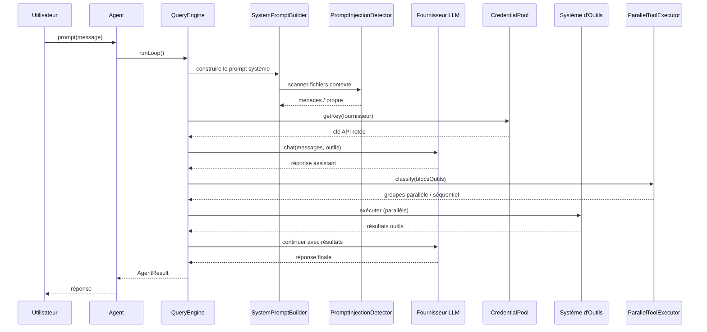

# SuperAgent Architecture — Graphe de Dépendances

> **Version :** 0.8.6 | **Généré le :** 2026-04-14

> Le graphe mermaid principal se trouve dans [la version anglaise ARCHITECTURE.md](ARCHITECTURE.md#core-system-dependencies). La version française conserve le graphe de base ; seules les descriptions des nouveaux sous-systèmes (CLI / Auth / Foundation / Memory Palace / Coordinator / Middleware) sont mises à jour ici. La version anglaise contient les dépendances CLI + OAuth complètes.

> **Langue** : [English](ARCHITECTURE.md) | [中文](ARCHITECTURE_CN.md) | [Français](ARCHITECTURE_FR.md)

## Dépendances du Système Principal

```mermaid
%%{init: {'flowchart': {'rankSpacing': 60, 'nodeSpacing': 30}}}%%
graph TB
    subgraph Entry["Points d'Entrée"]
        Agent["Agent.php"]
        HarnessLoop["HarnessLoop"]
        Bridge["Bridge HTTP Proxy"]
    end

    subgraph Core["Moteur Principal"]
        QE["QueryEngine<br/>(930 lignes)"]
        SPB["SystemPromptBuilder"]
        MR["ModelResolver"]
    end

    subgraph Providers["Fournisseurs LLM"]
        PR["ProviderRegistry"]
        CP["CredentialPool"]
        AP["AnthropicProvider"]
        OP["OpenAIProvider"]
        ORP["OpenRouterProvider"]
        BP["BedrockProvider"]
        OLP["OllamaProvider"]
        FP["FallbackProvider"]
        RM["RetryMiddleware"]
    end

    subgraph Tools["Système d'Outils"]
        TL["ToolLoader"]
        BTR["BuiltinToolRegistry<br/>(65 outils)"]
        TNR["ToolNameResolver"]
        TSM["ToolStateManager"]
        TSF["ToolSchemaFilter"]
    end

    subgraph Optimization["Optimisation (v0.7.0+v0.8.0)"]
        TRC["ToolResultCompactor"]
        CC["ContextCompressor<br/>(v0.8.0)"]
        MRt["ModelRouter"]
        QCR["QueryComplexityRouter<br/>(v0.8.0)"]
        RP["ResponsePrefill"]
        PCP["PromptCachePinning"]
    end

    subgraph Performance["Performance"]
        PTE["ParallelToolExecutor<br/>(chemins v0.8.0)"]
        STD["StreamingToolDispatch"]
        SP["SpeculativePrefetch"]
        AMT["AdaptiveMaxTokens"]
        CPool["ConnectionPool"]
    end

    subgraph Security["Sécurité & Guardrails"]
        BSV["BashSecurityValidator<br/>(23 checks)"]
        SCC["SecurityCheckChain<br/>(v0.8.0)"]
        GE["GuardrailsEngine"]
        PID["PromptInjectionDetector<br/>(v0.8.0)"]
        PE["PermissionEngine"]
        PRE["PathRuleEvaluator"]
    end

    subgraph Memory["Système de Mémoire (v0.8.0)"]
        MPI["MemoryProviderInterface"]
        MPM["MemoryProviderManager"]
        BMP["BuiltinMemoryProvider"]
        MS["MemoryStorage"]
        ME["MemoryExtractor"]
        MRv["MemoryRetriever"]
        ADC["AutoDreamConsolidator"]
        DL["DailyLog (KAIROS)"]
        SME["SessionMemoryExtractor"]
    end

    subgraph Session["Session (v0.8.0)"]
        SM["SessionManager"]
        SS["SessionStorage (fichiers)"]
        SPS["SessionPruner"]
        SQS["SqliteSessionStorage<br/>(WAL+FTS5 v0.8.0)"]
    end

    subgraph Swarm["Orchestration Multi-Agents"]
        PAC["ParallelAgentCoordinator"]
        AT["AgentTool"]
        PB["ProcessBackend"]
        IPB["InProcessBackend"]
        TB["TmuxBackend"]
        ITB["ITermBackend"]
        DB["DistributedBackend"]
        ADM["AgentDependencyManager"]
        ACP["AgentCommunicationProtocol"]
        APP["AgentPerformanceProfiler"]
        TC["TeamContext"]
    end

    subgraph Intelligence["Intelligence"]
        SCM["SmartContextManager"]
        KG["KnowledgeGraph"]
        AF["AdaptiveFeedback"]
        CA["CostAutopilot"]
        CPred["CostPredictor"]
        SD["DistillationEngine"]
    end

    subgraph Pipeline["Pipeline & Workflow"]
        PEng["PipelineEngine"]
        SH["SelfHealingStrategy"]
        DO["DebateOrchestrator"]
        FM["ForkManager"]
        RR["ReplayRecorder"]
    end

    subgraph Infra["Infrastructure"]
        MCP["MCPManager"]
        PM["PluginManager"]
        SKM["SkillManager"]
        SKC["SkillCatalogTool<br/>(v0.8.0)"]
        HR["HookRegistry"]
        HRL["HookReloader"]
        PH["PromptHook"]
        CM["ChannelManager"]
        AS["AppStateStore"]
        SSW["SafeStreamWriter<br/>(v0.8.0)"]
    end

    Agent --> QE
    HarnessLoop --> QE
    Agent --> MR
    Agent --> PR
    QE --> SPB
    QE --> TL
    QE --> PTE

    PR --> CP
    PR --> AP
    PR --> OP
    PR --> ORP
    PR --> BP
    PR --> OLP
    PR --> FP
    CP -.->|rotation clés| AP
    CP -.->|rotation clés| OP
    RM -.->|enveloppe| AP
    RM -.->|enveloppe| OP

    TL --> BTR
    TL --> TNR
    BTR --> TSM
    QE --> TSF

    QE --> TRC
    QE --> CC
    QE --> MRt
    QE --> QCR
    QE --> RP
    SPB --> PCP

    SPB --> PID
    QE --> GE
    QE --> PE
    PE --> PRE
    GE --> BSV
    BSV -.-> SCC

    MPM --> BMP
    MPM --> MPI
    BMP --> MS
    BMP --> MRv
    BMP --> ME
    ADC --> MS
    ADC --> DL
    SPB --> MPM

    SM --> SS
    SM --> SPS
    SM --> SQS

    AT --> PAC
    AT --> PB
    AT --> IPB
    PAC --> TC
    PAC --> ADM
    PAC --> ACP
    PAC --> APP
    PB --> DB
    PB --> TB
    PB --> ITB

    QE --> SCM
    QE --> KG
    QE --> CA
    CA --> CPred
    QE --> AF

    PEng --> SH
    PEng --> QE

    SPB -.->|scan fichiers contexte| PID
    QE --> MCP
    QE --> HR
    HR --> HRL
    HR --> PH
    PM --> SKM
    SKM --> SKC

    classDef new fill:#e1f5fe,stroke:#0288d1,stroke-width:2px
    classDef core fill:#fff3e0,stroke:#f57c00,stroke-width:2px
    classDef security fill:#fce4ec,stroke:#c62828,stroke-width:2px

    class CC,QCR,PID,SCC,CP,MPM,MPI,BMP,SQS,SKC,SSW,ADM new
    class QE,Agent,HarnessLoop core
    class BSV,GE,PID,PE,PRE security
```

## Compteurs de Sous-systèmes (v0.8.6)

| Catégorie | Fichiers | Lignes | Δ depuis v0.8.0 |
|-----------|----------|--------|------------------|
| Core (Agent, QueryEngine, Prompt) | 12 | ~2 600 | — |
| **CLI + Console + Auth (nouveau)** | **17** | **~2 687** | **Nouveau (v0.8.5 + v0.8.6)** |
| **Foundation (nouveau)** | **2** | **~550** | **Nouveau (v0.8.5 + v0.8.6)** |
| Fournisseurs (compatibles OAuth) | 12 | ~3 800 | +~100 (chemins OAuth) |
| Outils | 74 | ~11 300 | — |
| Optimisation | 8 | ~2 100 | — |
| Performance | 8 | ~2 100 | — |
| Sécurité & Guardrails | 33 | ~3 200 | — |
| Mémoire (incl. **Palace**) | 42 | ~5 400 | **+2 289 (Palace v0.8.5)** |
| Session | 4 | ~1 600 | — |
| Orchestration Multi-Agents | 34 | ~7 300 | — |
| **Coordinator (nouveau)** | **14** | **~2 800** | **Nouveau (v0.8.2)** |
| Harness | 21 | ~1 800 | — |
| **Middleware (nouveau)** | **7** | **~900** | **Nouveau (v0.8.1)** |
| Intelligence | 20 | ~3 500 | — |
| Pipeline | 24 | ~3 764 | — |
| Infrastructure | 40 | ~5 000 | — |
| **Total** | **566** | **~93 395** | **+70 fichiers / +12 159 lignes** |

## Flux de Données

## Décisions de Conception Clés

1. **Architecture double-déploiement (v0.8.6)** : package Laravel + binaire CLI standalone partagent le même `Agent` / `HarnessLoop` / `CommandRouter` / `MemoryProviderManager` / `SessionManager`. L'adaptation se fait à la frontière (polyfill `config()`/`app()`/`storage_path()` + `Foundation\Application` conteneur minimal reproduisant l'API bind/singleton/make de Laravel)
2. **Import de credentials OAuth (v0.8.6)** : `src/Auth/` lit les tokens locaux existants de Claude Code / Codex et les injecte dans le mode Bearer du provider. Refresh transparent ; le provider insère automatiquement le bloc système d'identité Claude Code ; les ids de modèles legacy sont réécrits silencieusement
3. **Memory Palace comme provider externe (v0.8.5)** : s'intègre au `MemoryProviderManager` comme second provider aux côtés du flux `MEMORY.md` intégré. Wings/Halls/Rooms/Drawers + Tunnels + pile 4 couches (L0 Identité / L1 Faits Critiques / L2 Rappel de Room / L3 Recherche Profonde). Tunnels auto-créés quand la même Room apparaît dans plusieurs Wings
4. **Pipeline de Collaboration (v0.8.2)** : DAG multi-agents par phases avec tri topologique, 4 stratégies d'échec, 8 événements de cycle de vie. Les agents d'une phase s'exécutent en vrai parallèle via `ParallelPhaseExecutor` + `ProcessBackend` / `InProcessBackend`
5. **Onion middleware (v0.8.1)** : `MiddlewarePipeline` compose rate-limit + retry + cost-tracking + logging + guardrail autour de chaque appel provider, par ordre de priorité
6. **Double écriture sessions (v0.8.0)** : Fichier (rétrocompat) + SQLite (recherche). Fallback gracieux si SQLite indisponible
7. **Parallélisme par chemin (v0.8.0)** : Outils d'écriture classés par chemin cible, pas seulement par flag lecture-seule
8. **Isolation des fournisseurs de mémoire** : Les erreurs du fournisseur externe ne font jamais crasher l'agent
9. **Rotation des credentials (v0.8.0) + OAuth bearer (v0.8.6)** : Les deux intégrés au niveau `ProviderRegistry` — transparent pour tous les consommateurs
10. **Scan d'injection de prompt** : Intégré dans `SystemPromptBuilder` — scan automatique des fichiers contexte via `withContextFiles()`
11. **Chargement progressif de skills** : Deux phases (métadonnées → contenu complet) pour minimiser l'overhead en tokens
12. **`SecurityCheckChain`** : Enveloppe le validateur 23-checks existant tout en permettant l'insertion de checks personnalisés
